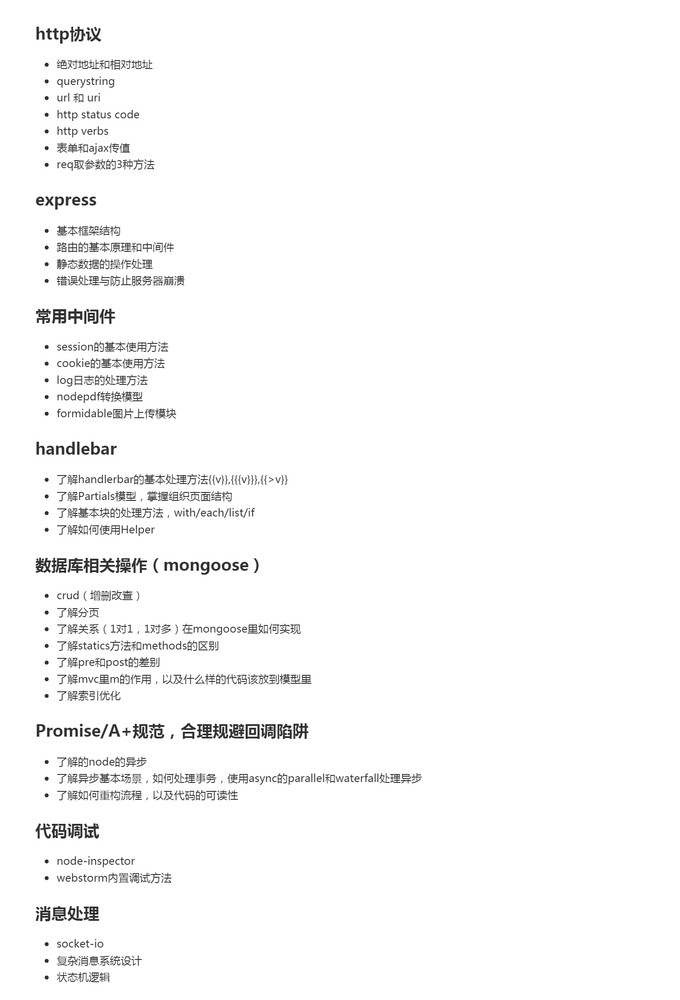
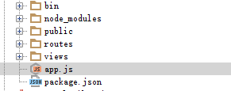

###markdon语法学习
# 一级标题

## 二级标题

### 三级标题

####无序列表
* 1
* 2
* 3

####有序列表
1. 1
2. 2
3. 3

####插入代码块
```javascript
app.post('/login',function(req,res,next){
	var username = req.body.name;
	var password = req.body.password;
});
```
```c
int a = 10;
int b = 20;
```

`http`

####引用格式
> 这里是引用

只需要在文本前加入 > 这种尖括号（大于号）即可  
>引用说明：......
>>分层次说明：......

####插入图片
格式:\!\[\]\(\){ImgCap}{/ImgCap}


####插入链接
[baidu](http://www.baidu.com)

####粗体与斜体
Markdown 的粗体和斜体也非常简单，用两个 * 包含一段文本就是粗体的语法，用一个 * 包含一段文本就是斜体的语法。

**这里是粗体** *这里是斜体*

####表格
| Tables        | Are           | Cool  |
| ------------- |:-------------:| -----:|
| col 3 is      | right-aligned | $1600 |
| col 2 is      | centered      |   $12 |
| zebra stripes | are neat      |    $1 |

####很多空行
&ensp;  
&ensp;  
&ensp;  
&ensp;  
&ensp;  

####很多空格  
&emsp;&emsp;&emsp;&emsp;

####转移字符  
\\\# ---> \#


# 知识点复习  
&ensp;  
&ensp;  
###http协议
* 绝对地址和相对地址
* querystring
* url和uri
* http status code
* http verbs
* 表单和ajax传值
* req取参数的3种方式
###express
>精简的、灵活的Node.js Web 程序框架，为构建单页、多页及混合的Web 程序提供了一系列健壮的功能特性  

* 基本框架结构  
  
`node_modules:`  
&emsp;&emsp;储存nodejs的包的文件夹  
`public:`  
&emsp;&emsp;放置静态文件，刚创建时默认有`images`，`javascripts`，`stylesheets`，三个文件夹，分别用于储存图片，js文件，css文件。  
`routes:`  
&emsp;&emsp;`routes`是一个文件夹形式的本地模块，即./routes/index.js，它的功能是为指定路径组织返回内容，相当于 MVC 架构中的控制器。  
`views`  
&emsp;&emsp;视图文件的目录,存放模板文件。但是这种视图并不是传统的html文件，而是html的引擎模板。  
`app.js`  
&emsp;&emsp;工程实例，以下对app.js的代码进行解读
```javascript
//require 是一个用来引入模块的Node函数。Node 默认会在目录node_modules中寻找这些模块
//引入express模块
var express = require('express');
//path模块提供1.路径解析，得到规范化的路径格式，2.路径结合、合并，路径最后不会带目录分隔符，3.获取绝对路径等路径处理功能
var path = require('path');
//serve-favicon替换了原有的static-favicon模块，提供favicon（出现在浏览器标题栏上的图标），这个东西不是必需的
var favicon = require('serve-favicon');
//morgan提供自动日志记录支持：所有请求都会被记录。
var logger = require('morgan');
//提供cookie 存储的会话支持。
var cookieParser = require('cookie-parser');
//只连入json 和urlencoded 的便利中间件。解析JSON 编码的请求体和解析互联网媒体类型为application/x-www-form-urlencoded 的请求体。
var bodyParser = require('body-parser');
//获取路由文件，相当于控制器，用于组织展示的内容，但一般在之后会被修改为require('./routes');
var routes = require('./routes/index');
//也是获取路由文件，反正在后面都会被修改
var users = require('./routes/users');
//表示创建express应用程序
var app = express();

// 设定视图路径
app.set('views', path.join(__dirname, 'views'));
// 设定视图引擎模板
app.set('view engine', 'hbs');

// uncomment after placing your favicon in /public
//app.use(favicon(path.join(__dirname, 'public', 'favicon.ico')));
app.use(logger('dev'));
app.use(bodyParser.json());
app.use(bodyParser.urlencoded({ extended: false }));
app.use(cookieParser());
//设定静态文件路径，__dirname 会被解析为正在执行的脚本所在的目录。所以如果你的脚本放在/home/sites/app.js 中，则__dirname 会被解析为/home/sites。
app.use(express.static(path.join(__dirname, 'public')));
//使用中间件 routes,可选参数path默认为"/"。使用 app.use() “定义的”中间件的顺序非常重要，它们将会顺序
//执行，use的先后顺序决定了中间件的优先级(经常有搞错顺序的时候);用户如果访问“ / ”路径，则由 routes.index 来控制
app.use('/', routes);
//用户如果访问“ /users ”路径，则由 routes.users 来控制
app.use('/users', users);

// catch 404 and forward to error handler
app.use(function(req, res, next) {
  var err = new Error('Not Found');
  err.status = 404;
  next(err);
});

// error handlers

// development error handler
// will print stacktrace
if (app.get('env') === 'development') {
  app.use(function(err, req, res, next) {
    res.status(err.status || 500);
    res.render('error', {
      message: err.message,
      error: err
    });
  });
}

// production error handler
// no stacktraces leaked to user
app.use(function(err, req, res, next) {
  res.status(err.status || 500);
  res.render('error', {
    message: err.message,
    error: {}
  });
});


module.exports = app;

```
`bin\www`  
&emsp;&emsp;工程入口,packege.json里有定义 "start": "node ./bin/www",


* 路由的基本原理和中间件  

路由是指向客户端提供它所发出的请求内容的机制。对基于Web 的客户端/ 服务器端程序而言，客户端在URL 中指明它想要的内容，具体来说就是路径和查询字符串。
```javascript
var http = require('http');
http.createServer(function(req,res){
// 规范化url，去掉查询字符串、可选的反斜杠，并把它变成小写
var path = req.url.replace(/\/?(?:\?.*)?$/, '').toLowerCase();
switch(path) {
	case '':
		res.writeHead(200, { 'Content-Type': 'text/plain' });
		res.end('Homepage');
		break;
	case '/about':
		res.writeHead(200, { 'Content-Type': 'text/plain' });
		res.end('About');
		break;
	default:
		res.writeHead(404, { 'Content-Type': 'text/plain' });
		res.end('Not Found');
		break;
	}
}).listen(3000);
console.log('Server started on localhost:3000; press Ctrl-C to terminate....');  
```  
运行这段代码，你会发现现在你可以访问首页 （http://localhost: 3000）和关于页面（http://localhost:3000/about）。所有查询字符串都会被忽略（所以http://localhost:3000/?foo=bar 也是返回首页），并且其他所有URL（http://localhost:3000/foo）返回的都是未找到页面。  

`http.createServer`创建了一个`http.Server`的实例,将一个函数作为`HTTP`请求处理函数。函数接受两个参数，分别是请求对象`req`和响应对象`res`。  

`res.writeHead(200, {'Content-Type': 'text/plain'});`用于向请求的客户端发送响应头，其中Content-Type的text/plain表示服务端需要返回一段普通文本给客户端，类似的还有
text/html  

**语法:**  
```
response.writeHead(statusCode, [reasonPhrase], [headers])
``` 
**接受参数:**  
`status`&emsp;&emsp;&emsp;HTTP状态码，如200(请求成功)，404(未找到)等。  
`reasonPhrase`&emsp;&emsp;&emsp;人类可读的'原因短句'  
`headers`&emsp;&emsp;&emsp;响应头的内容，表示响应头的每个属性  

`res.end`结束并发送  
最后调用`listen`，启动服务器并监听3000端头。


\_\_dirname 会被解析为正在执行的脚本所在的目录。所以如果你的脚本放在/home/sites/app.js 中，则__dirname 会被解析为/home/sites。

* 静态数据的操作处理
* 错误处理与防治服务器崩溃
&ensp;  
&ensp;  


# NODE-ZL
# 学习日志
###2016-06-27
### nodejs文件基本结构

/bin  
...www  
/node_modules  
...body-parser  
...cheerio  
...cookie-parser  
...debug  
...express  
...express-handlebars  
...hbs  
...mongoose  
...morgan  
...serve-favicon  
/public  
...images  
...javascripts  
...lib  
...stylesheets  
/routes  
...admin.js  
...index.js  
/views  
...admin  
...layouts  
...partials  
...blog.hbs  
...error.hbs  
...index.hbs  
...layout.hbs  
...login.hbs  
app.js  
package.json 


###如何配置hbs模板
```javascript
//先引入模块  
var exphbs =require('express-handlebars');  
```

```javascript
//配置hbs基础模板和分块模板  
var hbs = exphbs.create({  
  partialsDir: 'views/partials',  //partials默认路径为views/partials
  layoutsDir: "views/layouts/",   //layout默认路径为views/layouts/
  defaultLayout: 'main',          //默认布局模板为main.hbs
  extname: '.hbs'                 //设置文件后缀名为.hbs
});  

app.engine('hbs', hbs.engine);  
```


###如何映射静态文件目录  

```javascript

//路由中间件按照顺序匹配，在当前目录下无法匹配时，才进行下一步，默认为public文件夹
//使用static中间件 制定public目录为静态资源目录,其中资源不会经过任何处理
app.use(express.static(path.join(__dirname, 'public')));
app.use('/', routes);
//localhost:3000/ 映射到routes文件夹下
app.use('/admin', admin);
//localhost:3000/admin映射到admin文件夹下
```

###  

### 如何配置路由

```javascript
//获取express模块，并且新建router
var express = require('express');
var router = express.Router();

/* GET home page. */
router.get('/blog', function(req, res, next) {
  res.render('blog', { title: 'Express' , layout:'main'} );
});
//localhost:3000/blog，转到blog.hbs，显示布局为main.hbs
router.get('/login', function(req,res,next) {
    res.render('login',{ title: 'Express', layout:'lg'});
});
//localhost:3000/login，转到login.hbs，显示布局改为lg.hbs

module.exports = router; //开放router的对外接口
```

###上面部分从某个同学抄过来- -


###z-index无效该怎么办
在设置元素的堆叠顺序时发现z-index无效，有可能是没有设施position的原因。多个需要产生堆叠效果的div中，选择一个设置为absolute或者relative即可。
###如何实现多个div自适应屏幕高度
在上一个div具有一定高度后，下一个的div要想占满整个页面，需要设置height:100%，但这样很明显界面会溢出，所以需要将上一个div改成absolute或者需要适应的div设置marigin-top:-XXpx


###2016-06-28

###今天完成任务总结
安装了MongoDB，Robomong，以及WebStorm关于MongoDB的插件。

###
###如何安装MongoDB
主要需要注意的是配置MongoDB的环境。在MongoDB文件夹下创建db文件夹和log文件夹，log文件夹下需要创建MongoDB.log（MongoDB的日志文件）。
###
进入cmd
###
输入：D:\MongoDB\bin>mongod --dbpath D:\MongoDB\db
###
作用：将mongodb的数据库文件创建到D:\MongoDB\db目录
###
输入：D:\MongoDB\bin>mongod -dbpath "D:\MongoDB\db" -logpath "D:\MongoDB\log\MongoDB.log" -install -serviceName "MongoDB"（这里必须以管理员身份运行cmd）
###
作用：注册MongoDB Service
###
以管理员身份运行cmd，输入net start MongoDB(开启服务)，net stop MongoDB(关闭服务)
###用mongoose操作MongoDB
###获得mongoose模板
```javascript
var mongoose = require('mongoose');
mongoose.connect("mongodb://127.0.0.1:27017/test");
/*  var Schema = mongoose.Schema;  用Schema代替mongoose.Schema*/
```
###存储数据
```javascript
var PersonInfo = new mongoose.Schema({
    age       : Number,
    id        : String,
    phone     : String,
    colloge   : String,
    hometown  : String
});

var Person = mongoose.model('Person',PersonInfo);

var person = new Person({
    age     :'20',
    id      :'3326241995123456',
    phone   :'13819630116',
    colloge :'hznu',
    hometown :'xianju'
})

person.save(function (err) {
    if(err){
        console.log('保存失败');
    }
    console.log('success');
})
```
###增加数据
```javascript
var person1 = new Person({
    age     :'15',
    id      :'3326242000123456',
    phone   :'1776542365',
    colloge :'no',
    hometown :'xianju'
})
person1.save(function (err) {
    if(err){
        console.log('保存失败');
    }
    console.log('success');
})
```
###修改数据
```javascript
var conditions = {age:20};
var update={$set:{hometown:'taizhou'}};
//第一个参数conditions是选择条件，第二个参数update是选择后该如何更改的参数,第三个是回调函数
Person.update(conditions,update,function (error,data) {
    if(error){
        console.log(error);
    }else{
        console.log(data);
    }
})
```
###删除数据
```javascript
Person.remove({age:20},function (err) {
    if(err){
        console.log(err);
    }else{
        console.log('删除成功');
    }
})
```
###查询数据
```javascript
//$lt表示小于
Person.find({"age":{"$lt":19}},function (error,docs) {
    if(error){
        console.log(error);
    }else{
        console.log(docs);
    }
})
```
###500错误
500是服务器内部错误
###「理解HTTP」之常见的状态码 
https://segmentfault.com/a/1190000005338367?hmsr=toutiao.io&utm_medium=toutiao.io&utm_source=toutiao.io
###如何更快的下载模板
npm install -g mongoose --registry=https://registry.npm.taobao.org


###心得
初次接触WebStorm，觉得功能不错，但是上手阶段有些不适应。安装MongoDB以及配置环境时觉得很麻烦，让我想起了当初配置java的时候
，简直一个德性。不管怎么说获得的还是很多的，希望一年后能玩出个赏心悦目的blog。

###2016-06-29
###如何让div沉底
在进行布局的时候会发现div无法沉底，如果设置position：absolute会和父元素的父元素进行匹配，原因在于父元素没有设置position这一属性。
###子元素设置margin属性导致父元素也产生偏移
body内设置一个img，在使用margin-top后，整个body也会产生偏移，经检查是html元素也需要设置position。
###完成登录功能时遇到的BUG
世界上没有什么BUG是一个小时解决不了的，如果有，那就五个小时
###
首先，我第一次nodejs的版本是6.X，在webstorm上debug的时候会出现各种v8debug is not defined的提示，看得让人很别扭。解决BUG是多个步骤合起来的，具体也不清楚是哪一步。
一：login.js文件末端添加
```javascript
<script src="/blog/login.js"></script>
```
二：卸载6.X版本的nodejs版本，装为4.4.6.第一次nodejs默认装在Program Files而不是Program Files（x86），我的系统是64位，让人不得不怀疑我下错了32位的nodejs。
三：head.hbs文件添加
```javascript
<script src="/lib/cookies/jquery.cookie.js"></script>
```
###
于是，就把这奇怪的bug给解决了。
###登录功能的相关实现
一：index.js文件添加如下代码
```javascript
var dbHelper = require('../db/dbHelper');
router.post('/login', function(req, res, next) {
    dbHelper.findUsr(req.body, function (success, doc) {
        res.send(doc);
    })
});
```
推测../db/dbHelper中的..是父文件夹的父文件夹
二：创建user.js,用以包含user的数据
三：dbHelper.js实现查找用户名和密码
```javascript
exports.findUsr = function (data,cb) {
    User.findOne({
        username:data.usr
    },function (err,doc) {
        var user = (doc!==null)? doc.toObject() : '';
        if(err){
            console.log(err)
        }else if(doc===null){
            entries.code = 99;
            entries.msg='用户名错误！';
            cb(false,entries);
        }else if(user.password!==data.pwd){
            entries.code = 99;
            entries.msg='密码错误！';
            cb(false,entries);
        }else if(user.password===data.pwd){
            entries.data = user;
            entries.code=0;
            cb(true,entries);
        }

    })
}
```
四：login.js提交登录数据，根据返回的数据来进行下一步操作

###2016-06-30
###如何使段落中的文本不换行
white-space: nowrap
###如何使自己定义的css属性覆盖bootstrap
添加！important
###将数据库的内容导入到页面中
```javascript
router.get('/blog', function(req, res, next) {
  dbHelper.findNews(req, function (success, data) {
    res.render('blog', {
      entries: data.results,
      pageCount: data.pageCount,
      pageNumber: data.pageNumber,
      count: data.count,
    });
  })
});

```
登录/blog页面后就会使用findNews，将数据传送给cb回调函数。

```javascript
{{#each entries}}
{{/each}}
```
包裹了需要复写的日志框
###数据库的相关知识
```javascript
var newsSchema = new Schema({
    title: String,
    content: String,
    meta: {
        updateAt: {type:Date, default: Date.now()},
        createAt: {type:Date, default: Date.now()}
    },
    author: {
      type: Schema.Types.ObjectId,
      ref: 'User'
    }
});
```

其中的
```javascript
    author: {
      type: Schema.Types.ObjectId,
      ref: 'User'
    }
```
ref表外部引用，相当于关系数据库的join

###还有东西想写，明天要练车去，晚上还得洗澡╮(╯▽╰)╭

###2016-07-07
###如何实现页面分页
核心代码
```javascript
<div class="box-footer">
    <nav>
        <ul class="pagination">
            <li>
                <a href="{{#le pageNumber 1}}?{{else}}?page={{reduce pageNumber 1}}{{/le}}"
                   aria-label="Previous">
                    <span aria-hidden="true">&laquo;</span>
                </a>
            </li>
            {{#times pageCount 1 pageCount}}
                <li {{#equals pageNumber this.step}}class="active" {{/equals}}>
                    <a href="?page={{step}}{{#if recommend}}&recommend={{recommend}}{{/if}}{{#if type}}&type={{type}}{{/if}}">{{step}}</a>
                </li>
            {{/times}}
            <li>
                <a href="{{#ge pageNumber pageCount}}?page={{pageCount}}{{else}}?page={{add pageNumber 1}}{{/ge}}"
                   aria-label="Previous">
                    <span aria-hidden="true">&raquo;</span>
                </a>
            </li>
        </ul>
    </nav>
</div>
```
这是基于bootstrap的功能，用于实现页面分页。由三部分li元素组成，第一部分和第三部分li表示页面往前和往后翻一页。第二部分li由数据库重复加载，表示1,2,3......页码。
因为不熟悉这个架构，所以全靠脑补。{{#le pageNumber 1}}?{{else}}?page={{reduce pageNumber 1}}{{/le}}将页面跳转到前一页，可以看出{{#le pageNumber 1}}{{/le}}两个
标签内涵判断条件#le pageNumber 1，pageNumber<=1的情况下进行某个动作，否则进行另一个动作。?{{else}}?page={{reduce pageNumber 1}}这个可能就是动作主题，由else判断，
条件成立的情况下不进行任何动作，不成立的情况下通过reduce将pageNumber-1实现往前跳转。{{#times pageCount 1 pageCount}}{{/times}}的功能可见hbsHelper的times函数功能
，用于循环插入数据。
###文章插入头像
在user数据里面插入imgUrl:String,通过更新数据操作更改imgUrl的地址，不过问题是更新数据操作只能更新一条，而且也没有实现头像。于是删除了全部的用户数据，然后插入一条
新的数据。于是就头像就出来了。
###2016-07-08
###无特殊内容
###2016-07-09
###清除浮动
有的时候希望父元素不为浮动（floft）元素，子元素为浮动元素。如果遇到该情景，会产生比较奇怪的展示问题。父元素包含两个子元素，一个左浮动，一个右浮动。如果不进行清除
浮动操作，也不设置父元素浮动，那么便发生如下情况：父元素的高度仅为padding的高度，失去了子元素的高度，使子元素达不成预期的效果。而如果父元素设置为浮动，那么高度
可以继承，但会失去宽度，宽度不再继承再上一级的父元素。两个子元素会挤在一起。
有两个解决方法：
一：父元素::before {
    content: " ";
    display: table;
}
::after {
    content: " ";
    display: table;
}
::after {
    clear: both;
}
便可以保证子元素浮动的情况下，父元素不需要设置浮动
二：父元素设置为floft：left，width：100%；
其中一是老师的解决方法，二是我自己琢磨出来的，我觉得老师的方法比较高大上。
###data-toggle的作用
data-toggle用于调用bootstrap，可以实现下拉菜单dropdown功能和confirm确认功能等。data-message目测用于确认功能的提示功能。
###data-toggle的具体用法
例如想实现确认的功能，data-toggle="confirm"，data-message="确认要删除此文章吗"，其中data-message的内容表示提示框的内容。
```javascript
//删除警告确认对话框
$('[data-toggle="confirm"]').on('click', function (e) {
    e.preventDefault();
    var $this = $(this);
    var msg = $this.data('message');
    if (confirm(msg)) {
        location.href = $this.attr('href');
    }
});

```
这一段代码在js中，用于实现confirm功能
代码分析：其中var msg = $this.data('message');调用了jQuery.data()方法，将this指向的当前对象中的message（推测是data-message的数据）转化为var对象。
confirm是js确认框函数，msg为确认框相对应的解释语句，如果按下确定则将location.href设置为当前对象的href值，表跳转到某一个界面。
###2016-07-10
###渲染新闻列表
```javascript
<a href="/admin/newsList" class="btn btn-default btn-flat">后台管理</a>
```
地址切换到views/admin/newsList.hbs，网页效果是header和sidebar不变，右下角展现新闻内容的部分变为后台管理。要实现部分替换的功能需要以下代码：
admin.js代码里需要添加
```javascript
router.get('/newsList', function(req, res, next) {

  var msg = req.session['message'] || '';
  req.session['message'] = "";

  dbHelper.findNews(req, function (success, data) {

    res.render('./admin/newsList', {
      entries: data.results,
      pageCount: data.pageCount,
      pageNumber: data.pageNumber,
      count: data.count,
      layout: 'admin',
      message: msg
    });
  })
});
```
render('')中的参数为一个hbs布局，{}里面的layout的参数是全体布局。全体布局中的{{{body}}}部分由render内的参数替换，所以可以实现跳转到局部布局而实现整体切换。
###2016-07-11
###实现删除功能获得的知识
```javascript
<a href="/admin/newsDelete/{{_id}}" class="btn btn-block btn-primary btn-xs" data-toggle="confirm" data-message="确认要删除此文章吗">
```
如何准确删除所选文章？
```javascript
{{#each entries}}
    <tr>
        <td><a href="/pdf/blogPdf/{{_id}}">{{title}}</a></td>
        <td>{{author.username}}</td>
        <td>{{formatDate meta.createAt}}</td>
        <td><a href="/admin/newsDelete/{{_id}}" class="btn btn-block btn-primary btn-xs" data-toggle="confirm"
               data-message="确认要删除此文章吗">删除</a></td>
    </tr>
{{/each}}
```
这部分表示后台界面的关于文章相关信息的一行数据，分别是文章名，作者名，创建日期，删除。这四个都是由出自同一个id的数据（表达有问题，需要改进。
href="/admin/newsDelete/{{_id}}"中的{{_id}}传输了你所想要删除的文章的主键（_id是某一条数据的主键）。
href将跳转至/admin/newsDelete/{{_id}}这个网址，被admin.js接收到，出发相关代码
```javascript
//删除新闻
router.get('/newsDelete/:id', function(req, res, next) {

  var id = req.params.id;
  dbHelper.deleteNews(id, function (success, data) {

    req.session['message'] = data.msg;
    res.redirect("/admin/newsList");
  })
});
```
相关猜测，/:id这部分将/后面部分的字符转换为id参数。
var id = req.params.id;表示想服务器传输的参数id赋值给id。然后触发dbHelper的deleteNews函数删除对应文章。req.session['message'] = data.msg;功能不明，
res.redirect("/admin/newsList");猜测用于将网站回滚回/admin/newsList。
###实现新建文章或者删除文章时的Toast功能
###删除功能的Toast的实现
首先需要引入两个文件
```javascript
<link rel="stylesheet" href="/lib/toastr/toastr.css">
<script src="/lib/toastr/toastr.js"></script>
```
按下删除后，触发跳转至admin.js的相关代码（上面有）。在之前猜测req.session['message'] = data.msg;代码功能未清楚，现在清楚了。
在后台管理界面有一行代码
```javascript
<div class="box-msg hidden">{{message}}</div>
```
可以推测出来data.msg赋值给{{message}}里面，于是触发了newsListAdmin.js的
```javascript
$(init);

function init() {

  var msg = $(".box-msg").text();
  if (msg!=="") {
    notifyInfo(msg);
    $(".box-msg").text("");
  }
}

```
当msg不为空的时候，触发notifyInfo(msg)函数，其中
```javascript
function notifyInfo(info) {
    // alertify.set({ delay: 5000 });
    // alertify.success(info);
    toastr["success"](info)
}
```
为触发toast的主代码，推测"success"表示成功的样式，(info)为提示的内容。触发成功后将 $(".box-msg").text("");置为空内容，于是删除功能的弹出框完成。
###2016-07-12
###req.protocol
经查询，req.protocol可能等于"http"(字符串)
###2016-07-14
###如何实现文章pdf导出
一：首先需要下载phantomjs(通过npm下载)，电脑也需下载了phantomjs。
二：在C:\Users\zhanglele\AppData\Local\Temp\phantomjs路径下放置phantomjs-2.1.1-windows.zip
三：可能需要npm install phantomjs -g(全局安装)
完成这个三点基本就完成通过nodejs转换pdf的配置(真坑)
###pdf.js关键代码
```javascript
router.get('/:id', function (req, res, next) {

    var id = req.params.id;
    var host = req.protocol + '://' + req.get('host') + '/pdf/blogPdf/' + id;
    var pdffile = config.site.path + '\\pdf\\news-' + Date.now() + '.pdf';

    NodePDF.render(host, pdffile, function(err, filePath){
        if (err) {
            console.log(err);
        }else{
            fs.readFile(pdffile , function (err,data){
                res.contentType("application/pdf");
                res.send(data);
            });
        }
    });
})
router.get('/blogPdf/:id', function(req, res, next) {

    var id = req.params.id;
    dbHelper.findNewsOne(req, id, function (success, data) {
        res.render('pdfblog', {
            entries: data,
        });
    })
});

```
推测req.get('host')(在浏览器上证实)是localhost:3000
var pdffile = config.site.path + '\\pdf\\news-' + Date.now() + '.pdf';代码用于存储pdf文件的路径，推测config.site.path就是public文件夹
NodePDF.render的第一个参数host用于将页面跳转至某个地址，由下面的函数可以看到触发了router.get('/blogPdf/:id', function(req, res, next)函数，打开pdfblog.hbs的
布局文件。
###关于read more的问题
这个问题涉及到布局，老师的布局和我有所区别。所以明天要好好理解下布局的问题！
###2016-07-15
###pdf BUG1
转换pdf过程中，发生了奇怪的bug。生成的pdf文字会溢出，经过检测，是pdf布局最外面的div设置width宽度导致这个bug。
解决方法：设置两个布局，一个用于阅读全文，一个用于转化pdf，感觉冗余度爆炸，郁闷！

###2016-07-16
###对方不想说话
并向你扔了一堆bug，妈的个蛋，在昆明无线速度超级慢，用自己手机的4g开热点才能从git上下载原来的代码。 还是那个老bug，pdf转出来后产生各种奇葩的傻逼问题，改了布局之后问题更多。天天充斥的无数的bug，心疼自己。

###2016-07-17
###如何解决PDF BUG1？
这个bug就是转换成pdf后会出现布局文件的margin或者padding或者width都会影响到pdf上内容的呈现。execuse me？这明显就是个坑，因为你展示文章内容的布局不用以上三个属性
肯定会出种种问题。于是经过多次思考，觉得不仅仅为pdf设计一个新的hbs布局文件，还设置一个新的全局布局文件，避免sidebar或者headbar两个部分对内容展示的影响，一劳永逸。
此外还整体调整了下布局，更加轻便。
###如何解决PDF BUG2？
那当然是新的全局布局文件的{{head}}头文件不包含pace.css和pace.js两个文件啦，虽然有投机取巧之嫌，但也经实践可用。
###心情
你问我爽不爽，我当然爽啦，这些BUG最近搞得我好烦！吃不好睡不着。

###2016-07-20
###如何解决上传图片BUG？
新建一个upload文件夹就行了(有一种智商被戏弄的感觉)
###2016-07-22
###如何实现某个元素在页面绝对居中
```javascript
position:absolute;
left: 50%;
top: 50%;
transform: translate(-50%,-50%);
```
前三个好理解，第四个表示元素向左向上移动元素自己宽高的50%
###如何上传图片？
```javascript
<input type="file" id="uploadFile" multiple="multiple"  accept="image/*">
```
type="file" 用于文件上传。
accept="image/*" 不限制图像的格式
multiple="multiple"  属性规定输入字段可选择多个值

```javascript
<a class="btn btn-primary disabled" id="UploadBtn"><i class="fa fa-upload fa-fw"></i> 上传</a>
```
用于上传图片，其中id="UploadBtn"将js文件设置一系列动作

```javascript
function doUpload() {

    $(".pg-wrapper").show();

    var file = $("#uploadFile")[0].files[0];
    var form = new FormData();
    form.append("file", file);

    $.ajax({
        url: "/admin/uploadImg",
        type: "POST",
        data: form,
        async: true,
        processData: false,
        contentType: false,
        success: function(result) {
            startReq = false;
            if (result.code == 0) {

                var picUrl = $.format("",result.data)
                $("#newsContent").insertAtCaret(picUrl);
                $(".pg-wrapper").hide();
                // console.log(result.data);
            }
        }
    });
}
```
var file = $("#uploadFile")[0].files[0];用于提取uploadFile的内容files[0]表示提取第一个(输入确实可以有多个，如果将0改为1那就提取第二张图片)
var form = new FormData(); FormData是一个对象
form.append("file", file); append用于向对象添加字段
然后通过ajax发送数据到服务器。
服务器操作在admin.js里的router.post('/uploadImg', function(req, res, next) ，代码太长，贴出关键部分
```javascript
  .on('end', function() {

    console.log('-> upload done\n');
    entries.code = 0;
    entries.data = path;
    res.writeHead(200, {
      'content-type': 'text/json'
    });
    res.end(JSON.stringify(entries));
  })
```
res.end(JSON.stringify(entries)); 将entries转换为json数据并触发ajax的success事件，其中的result参数即是res返回的数据。

在admin.js中貌似还需要require('formidable');
###心得
这一段代码看下来收获不少，对于nodejs的web编程的理解更上一层楼。

