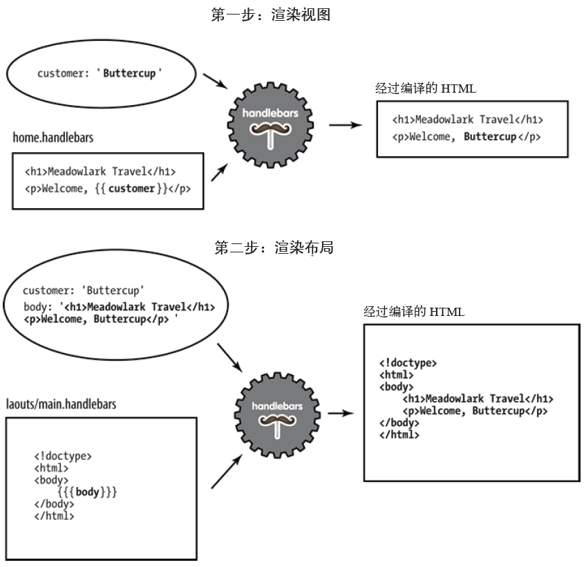

###markdon语法学习
# 一级标题

## 二级标题

### 三级标题

####无序列表
* 1
* 2
* 3

####有序列表
1. 1
2. 2
3. 3

####插入代码块
```javascript
app.post('/login',function(req,res,next){
	var username = req.body.name;
	var password = req.body.password;
});
```
```c
int a = 10;
int b = 20;
```

`http`

####引用格式
> 这里是引用

只需要在文本前加入 > 这种尖括号（大于号）即可  
>引用说明：......
>>分层次说明：......

####插入图片
格式:\!\[\]\(\){ImgCap}{/ImgCap}


####插入链接
[baidu](http://www.baidu.com)

####粗体与斜体
Markdown 的粗体和斜体也非常简单，用两个 * 包含一段文本就是粗体的语法，用一个 * 包含一段文本就是斜体的语法。

**这里是粗体** *这里是斜体*

####表格
| Tables        | Are           | Cool  |
| ------------- |:-------------:| -----:|
| col 3 is      | right-aligned | $1600 |
| col 2 is      | centered      |   $12 |
| zebra stripes | are neat      |    $1 |

####很多空行
&ensp;  
&ensp;  
&ensp;  
&ensp;  
&ensp;  

####很多空格  
&emsp;&emsp;&emsp;&emsp;

####转移字符  
\\\# ---> \#


# 知识点复习  
&ensp;  
&ensp;  
###http协议  
>HTTP是一个属于应用层的面向对象的协议，由于其简捷、快速的方式，适用于分布式超媒体信息系统。  
HTTP协议的主要特点可概括如下：  
1.支持客户/服务器模式。  
2.简单快速：客户向服务器请求服务时，只需传送请求方法和路径。请求方法常用的有GET、HEAD、POST。每种方法规定了客户与服务器联系的类型不同。由于HTTP协议简单，使得HTTP服务器的程序规模小，因而通信速度很快。  
3.灵活：HTTP允许传输任意类型的数据对象。正在传输的类型由Content-Type加以标记。  
4.无连接：无连接的含义是限制每次连接只处理一个请求。服务器处理完客户的请求，并收到客户的应答后，即断开连接。采用这种方式可以节省传输时间。  
5.无状态：HTTP协议是无状态协议。无状态是指协议对于事务处理没有记忆能力。缺少状态意味着如果后续处理需要前面的信息，则它必须重传，这样可能导致每次连接传送的数据量增大。另一方面，在服务器不需要先前信息时它的应答就较快。  

* 绝对地址和相对地址  
&emsp;&emsp;相对地址:就是被链接文件相对与当前页面的地址,../表示源文件所在目录的上一级目录(与当前文件的父文件同级的文件)，../../表示源文件所在目录的上上级目录链接根目录。同一文件夹下的文件可以用“./文件名”的形式（当前目录）。  
&emsp;&emsp;绝对地址:就是文件在网络或本地的绝对位置.绝对，具有唯一性，如官网地址,又例如 require('/home/byvoid/module')（/表示根目录）  
&emsp;&emsp;Node.js模块加载的一个重要特性：通过查找 node_modules 目录来加载模块，例如require('express')  

* querystring  
&emsp;&emsp;检索 HTTP 查询字符串中变量的值。HTTP 查询字符串由问号 (?) 后的值指定。比如常见的URL网页地址都有xxx.asp?pn=123456，?号后面的就是querystring。如上URL的querystring参数就是变量pn等于123456，可以
通过req.query.pn来获取pn变量。  
&emsp;&emsp;**语法:**  
&emsp;&emsp;Request.QueryString(variable)[(index)|.Count]  
*variable*  
&emsp;&emsp;在 HTTP 查询字符串中指定要检索的变量名  
*index*  
&emsp;&emsp;这是一个可选参数，可以用来检索 variable 的多个值中的某一个值。这可以是从1到Request.QueryString(variable).Count 之间的任何整数。  
**实例**  
&emsp;&emsp;客户端请求  
&emsp;&emsp;/scripts/directory-lookup.asp?name=fred&age=22  
&emsp;&emsp;results in the following QUERY_STRING value  
&emsp;&emsp;name=fred&age=22  
&emsp;&emsp;**QueryString**集合将包含 `name` 和 `age`两个成员。那么，您就可以使用下面的脚本。  
&emsp;&emsp;Request.QueryString("name"),Request.QueryString("age")来查找出name和age的属性


* url和uri  
####&emsp;&emsp;URL—Uniform Resource Location统一资源定位符    
  
&emsp;&emsp;**协议**  
&emsp;&emsp;协议确定如何传输请求。我们主要是处理http 和https。其他常见的协议还有file 和ftp。  
&emsp;&emsp;**主机名**  
&emsp;&emsp;主机名标识服务器。运行在本地计算机（localhost）和本地网络的服务器可以简单地表
示，比如用一个单词，或一个数字IP 地址。在Internet 环境下，主机名通常以一个顶
级域名（TLD）结尾，比如.com 或.net。另外，也许还会有子域名作为主机名的前缀。子域名可以是任何形式的，其中www 最为常见。子域名通常是可选的。  
&emsp;&emsp;**端口**  
&emsp;&emsp;每一台服务器都有一系列端口号。一些端口号比较“特殊”，如80 和443 端口。如果
省略端口值，那么默认80 端口负责HTTP 传输，443 端口负责HTTPS 传输。如果不使
用80 和443 端口，就需要一个大于10231 的端口号。通常使用容易记忆的端口号，如
3000、8080 或8088。  
&emsp;&emsp;**路径**  
&emsp;&emsp;URL 中影响应用程序的第一个组成部分通常是路径（在考虑协议、主机名和端口的基
础上做决定很合理，但是不够好）。路径是应用中的页面或其他资源的唯一标识。  
&emsp;&emsp;**查询字符串**  
&emsp;&emsp;查询字符串是一种键值对集合，是可选的。它以问号（?）开头，键值对则以与号（&）
分隔开。所有的名称和值都必须是URL 编码的。对此，JavaScript 提供了一个嵌入式的
函数encodeURIComponent 来处理。例如，空格被加号（+）替换。其他特殊字符被数字
型字符替换。  
&emsp;&emsp;**信息片段**  
&emsp;&emsp;信息片段（或散列）被严格限制在浏览器中使用，不会传递到服务器。用它控制单页应用或AJAX 富应用越来越普遍。最初，信息片段只是用来让浏览器展现文档中通过锚点
标记`（<a id="chapter06">）`指定的部分。  
####&emsp;&emsp;URI—Universal Resource Identifier通用资源标志符  
> Web上可用的每种资源 - HTML文档、图像、视频片段、程序等 - 由一个通过通用资源标志符(Universal Resource Identifier, 简称"URI")进行定位。  

&emsp;&emsp;1. 访问资源的命名机制。  
&emsp;&emsp;2. 存放资源的主机名。  
&emsp;&emsp;3. 资源自身的名称，由路径表示。  
> URI是一个相对来说更广泛的概念，URL是URI的一种，是URI命名机制的一个子集，可以说URI是抽象的，而具体要使用URL来定位资源。URI就是一种资源定位机制，它是比较笼统地定位了资源，并不局限于客户端和服务器，而URL就定位了网上的一切资源，只要是网上的资源，都有唯一的URL.  


* http status code  
**消息（1字头）**  
&emsp;&emsp;这一类型的状态码，代表请求已被接受，需要继续处理。这类响应是临时响应，只包含状态行和某些可选的响应头信息，并以空行结束。由于 HTTP/1.0 协议中没有定义任何 1xx 状态码，所以除非在某些试验条件下，服务器禁止向此类客户端发送 1xx 响应。  
**成功（2字头）**  
&emsp;&emsp;这一类型的状态码，代表请求已成功被服务器接收、理解、并接受  
&emsp;&emsp;**200 OK**  
&emsp;&emsp;请求已成功，请求所希望的响应头或数据体将随此响应返回。  
**重定向（3字头）**  
&emsp;&emsp;这类状态码代表需要客户端采取进一步的操作才能完成请求。通常，这些状态码用来重定向，后续的请求地址（重定向目标）在本次响应的 Location 域中指明。
当且仅当后续的请求所使用的方法是 GET 或者 HEAD 时，用户浏览器才可以在没有用户介入的情况下自动提交所需要的后续请求。客户端应当自动监测无限循环重定向（例如：A->A，或者A->B->C->A），因为这会导致服务器和客户端大量不必要的资源消耗。按照 HTTP/1.0 版规范的建议，浏览器不应自动访问超过5次的重定向。
&emsp;&emsp;**状态码301、302、303 和307**  
**请求错误（4字头）**  
&emsp;&emsp;这类的状态码代表了客户端看起来可能发生了错误，妨碍了服务器的处理。除非响应的是一个 HEAD 请求，否则服务器就应该返回一个解释当前错误状况的实体，以及这是临时的还是永久性的状况。这些状态码适用于任何请求方法。浏览器应当向用户显示任何包含在此类错误响应中的实体内容。
如果错误发生时客户端正在传送数据，那么使用TCP的服务器实现应当仔细确保在关闭客户端与服务器之间的连接之前，客户端已经收到了包含错误信息的数据包。如果客户端在收到错误信息后继续向服务器发送数据，服务器的TCP栈将向客户端发送一个重置数据包，以清除该客户端所有还未识别的输入缓冲，以免这些数据被服务器上的应用程序读取并干扰后者。  
&emsp;&emsp;**404 Not Found**  
&emsp;&emsp;请求失败，请求所希望得到的资源未被在服务器上发现。没有信息能够告诉用户这个状况到底是暂时的还是永久的。假如服务器知道情况的话，应当使用410状态码来告知旧资源因为某些内部的配置机制问题，已经永久的不可用，而且没有任何可以跳转的地址。404这个状态码被广泛应用于当服务器不想揭示到底为何请求被拒绝或者没有其他适合的响应可用的情况下。出现这个错误的最有可能的原因是服务器端没有这个页面。  
**服务器错误（5、6字头）**  
&emsp;&emsp;**500 Internal Server Error（服务器内部错误）**  
&emsp;&emsp;服务器遇到了一个未曾预料的状况，导致了它无法完成对请求的处理。一般来说，这个问题都会在服务器端的源代码出现错误时出现。  

* http verbs  
>HTTP 协议确定了客户端与服务器通信的请求方法集合（通常称为HTTP verbs）。很显然，
GET 和POST 最为常见。  

&emsp;&emsp;标准Http协议支持六种请求方法，即：  
&emsp;&emsp;**GET**  
&emsp;&emsp;&emsp;&emsp;在浏览器中键入一个URL（或点击一个链接），服务器会接收到一个HTTP GET 请求，其
中的重要信息是URL 路径和查询字符串。至于如何响应，则需要应用程序结合方法、路
径和查询字符串来决定。对于一个网站来说，大部分页面都响应GET请求。如何使用get方法传递参数见http协议的querystring部分，如何获取get方法的参数见路由（URL映射）部分  
&emsp;&emsp;**HEAD**  
&emsp;&emsp;**PUT**  
&emsp;&emsp;**DELETE**  
&emsp;&emsp;**POST**  
&emsp;&emsp;&emsp;&emsp;POST 请求通常用来提交信息到服务器后
台（例如表单处理）。服务器将请求中包含的所有信息（例如表单）处理完成之后，用以
响应的HTML 通常与相应的GET 请求是一样的。与服务器通信时，浏览器只使用GET 和
POST 方法（如果没有使用AJAX）。    

&emsp;&emsp;**OPTIONS**   

* 表单和ajax传值  

&emsp;&emsp;**html表单代码（登录界面）**
```html
    <form id="loginform" action="">
      <p class="login-box-msg text-red"></p>
      <div class="form-group has-feedback">
        <input type="text" class="form-control" placeholder="用户名" id="usr" required  minlength="3">
        <span class="glyphicon glyphicon-envelope form-control-feedback"></span>
      </div>
      <div class="form-group has-feedback">
        <input type="password" class="form-control" placeholder="密码" id="pwd">
        <span class="glyphicon glyphicon-lock form-control-feedback"></span>
      </div>
      <div class="row">
        <div class="col-xs-8">
        </div>
        <div class="col-xs-4">
          <button type="submit" class="btn btn-primary btn-block btn-flat" id="loginBtn">登 录</button>
        </div>
      </div>
    </form>
```
&emsp;&emsp;**ajax关键代码**
```javascript
function doLogin() {

  $.ajax({
    type: "POST",								//Ajax 请求使用GET方法，如果要使用POST方法，可以设定type参数值
    url: "/",
    contentType: "application/json",			//默认值: "application/x-www-form-urlencoded"。发送信息至服务器时内容编码类型。
    dataType: "json",							//预期服务器返回的数据类型
    data: JSON.stringify({						//发送到服务器的数据
      'usr': $("#usr").val(),
      'pwd': $("#pwd").val()
    }),
    success: function(result) {					//请求成功后的回调函数
      if (result.code == 99) {
        $(".login-box-msg").text(result.msg);
      } else {
        $.cookie('username', result.data.username, {expires:30});
        $.cookie('password', result.data.password, {expires:30});
        $.cookie('imgurl', result.data.imgUrl, {expires:30});
        $.cookie('id', result.data._id, {expires:30});
        location.href = "/p/blogs";
      }
    }
  })
}
```
&emsp;&emsp;**截取POST请求方式的url中含有/的请求**  
```javascript
router.post('/', function(req, res, next) {
  dbHelper.findUsr(req.body, function (success, doc) {
    req.session.user = doc.data;
    res.send(doc);
  })
});

```
* req取参数的3种方式  
&emsp;&emsp;req.query:处理`get`请求  
&emsp;&emsp;req.params:处理`/:xxx`形式的`get`请求  
&emsp;&emsp;req.body:处理`post`请求  
&emsp;&emsp;详情见路由部分的路由规则  
###常用中间件  
* session的基本使用方法  
首先:`npm install --save express-session`  
然后， 在链入cookie-parser之后链入express-session：  
`var cookieParser = require('cookie-parser');`  
`var session     = require('express-session');`  
```javascript
//加入session支持
app.use(session({
  name:'blogOfLiyang',								//这里的name值得是cookie的name，默认cookie的name是：connect.sid
  maxAge: 30 * 1000,								//设置maxAge是30000ms，即30s后session和相应的cookie失效过期
  secret: 'liyang-web-node-secret-key',
  resave: false,
  saveUninitialized: false
}));
```
session的原理：  
1). 生成全局唯一标识符（`sessionid`）；  
2). 开辟数据存储空间。一般会在内存中创建相应的数据结构，但这种情况下，系统一旦掉电，所有的会话数据就会丢失，如果是电子商务网站，这种事故会造成严重的后果。不过也可以写到文件里甚至存储在数据库中，这样虽然会增加`I/O`开销，但`session`可以实现某种程度的持久化，而且更有利于`session`的共享；  
3). 将`session`的全局唯一标示符发送给客户端。  
问题的关键就在服务端如何发送这个`session`的唯一标识上。联系到`HTTP`协议，数据无非可以放到请求行、头域或`Body`里，基于此，一般来说会有两种常用的方式：`cookie`和`URL`重写。  
####session和cookie的应用场景  
1.   应用场景
Cookie的典型应用场景是Remember Me服务，即用户的账户信息通过cookie的形式保存在客户端，当用户再次请求匹配的URL的时候，账户信息会被传送到服务端，交由相应的程序完成自动登录等功能。当然也可以保存一些客户端信息，比如页面布局以及搜索历史等等。
Session的典型应用场景是用户登录某网站之后，将其登录信息放入session，在以后的每次请求中查询相应的登录信息以确保该用户合法。当然还是有购物车等等经典场景；
2.   安全性
cookie将信息保存在客户端，如果不进行加密的话，无疑会暴露一些隐私信息，安全性很差，一般情况下敏感信息是经过加密后存储在cookie中，但很容易就会被窃取。而session只会将信息存储在服务端，如果存储在文件或数据库中，也有被窃取的可能，只是可能性比cookie小了太多。
Session安全性方面比较突出的是存在会话劫持的问题，这是一种安全威胁，这在下文会进行更详细的说明。总体来讲，session的安全性要高于cookie；
3.   性能
Cookie存储在客户端，消耗的是客户端的I/O和内存，而session存储在服务端，消耗的是服务端的资源。但是session对服务器造成的压力比较集中，而cookie很好地分散了资源消耗，就这点来说，cookie是要优于session的；
4.   时效性
Cookie可以通过设置有效期使其较长时间内存在于客户端，而session一般只有比较短的有效期（用户主动销毁session或关闭浏览器后引发超时）；
5.   其他
Cookie的处理在开发中没有session方便。而且cookie在客户端是有数量和大小的限制的，而session的大小却只以硬件为限制，能存储的数据无疑大了太多。  

&ensp;

`express-session`中间件的使用：  
&emsp;&emsp;只需要用`express app`的`use`方法将`session`挂载在'/'路径即可，这样所有的路由都可以访问到`session`。可以给要挂载的`session`传递不同的`option`参数，来控制`session`的不同特性。  
`session`内容的存储和更改：  
&emsp;&emsp;一旦我们将`express-session`中间件用`use`挂载后，我们可以很方便的通过`req`参数来存储和访问`session`对象的数据。`req.session`是一个`JSON`格式的`JavaScript`对象，我们可以在使用的过程中随意的增加成员，这些成员会自动的被保存到`option`参数指定的地方，默认即为内存中去。  
```javascript
app.get('/awesome', function(req, res){
     if(req.session.lastPage) {
         console.log('Last page was: ' + req.session.lastPage + ".");    
     }    
     req.session.lastPage = '/awesome'; //每一次访问时，session对象的lastPage会自动的保存或更新内存中的session中去。
     res.send("You're Awesome. And the session expired time is: " + req.session.cookie.maxAge);
});
```
`session`的生命周期  
&emsp;&emsp;`session`与发送到客户端浏览器的生命周期是一致的。而我们在挂载`session`的时候，通过`option`选项的`cookie`。`maxAge`成员，我们可以设置`session`的过期时间，以ms为单位（但是，如果`session`存储在`mongodb`中的话，任何低于60s(60000ms)的设置是没有用的）。如果`maxAge`不设置，默认为null，这样的`expire`的时间就是浏览器的关闭时间，即每次关闭浏览器的时候，`session`都会失效。  
####**详情见以下blog:**
[express 框架之session](http://www.cnblogs.com/chenchenluo/p/4197181.html)

* cookie的基本使用方法  

&emsp;&emsp;在程序中开始设置和访问cookie 之前， 需要先引入中间件cookie-parser。首先  
```javascript
npm install --save cookie-parser
```
&emsp;&emsp;然后:  
```javascript
var cookieParser = require('cookie-parser');
app.use(cookieParser());
```
&emsp;&emsp;cookie的相关操作  
&emsp;&emsp;**创建一个会话cookie：**  
```javascript
$.cookie('cookieName','cookieValue');
```
&emsp;&emsp;注：当没有指明cookie时间时，所创建的cookie有效期默认到用户浏览器关闭止，故被称为会话cookie。  

&emsp;&emsp;**创建一个持久cookie：**  
```javascript
$.cookie('cookieName','cookieValue',{expires:7});
```
&emsp;&emsp;注：当指明时间时，故称为持久cookie，并且有效时间为天。  

&emsp;&emsp;**创建一个持久并带有效路径的cookie：**  
```javascript
$.cookie('cookieName','cookieValue',{expires:7,path:'/'});
```
&emsp;&emsp;注：控制应用这个cookie 的路径。注意，路径会隐含地通配其后的路径。如果你用的路径
是/ （默认值），它会应用到网站的所有页面上。如果你用的路径是/foo，它会应用到
/foo、/foo/bar 等路径上。如果http://www.china.com/test/index.html 建立了一个cookie，那么在http://www.china.com/test/目录里的所有页面，以及该目录下面任何子目录里的页面都可以访问这个cookie。
这就是说，在http://www.china.com/test/test2/test3 里的任何页面都可以访问http://www.china.com/test/index.html建立的cookie。
但是，如果http://www.china.com/test/ 需要访问http://www.china.com/test/index.html设置的cookes，该怎么办？
这时，我们要把cookies的path属性设置成“/”。在指定路径的时候，凡是来自同一服务器，URL里有相同路径的所有WEB页面都可以共享cookies。  

&emsp;&emsp;**创建一个持久并带有效路径和域名的cookie：**  
```javascript
$.cookie('cookieName','cookieValue',{expires:7,path:'/,domain: 'chuhoo.com',secure: false,raw:false});
```
&emsp;&emsp;其实，cookie的domain属性所说的跨域，确切地说，应该是跨子域(subdomain)。比如我在bbs.readlog.cn这个子域（这里是二级域名）下设置的cookie，如果不特别的设置domain属性，那这个cookie就只能被bbs.readlog.cn这个子域下的程序读到，至于www.readlog.cn是无法读取到这个cookie的，而我如果在bbs.readlog.cn设置cookie的时候，设置cookie的domain属性为readlog.cn，那么所有的子域就都可以读到这个cookie了。  
&emsp;&emsp;Domain值是域名，比如www.china.com。这是对path路径属性的一个延伸。如果我们想让 www.china.com能够访问bbs.china.com设置的cookies，该怎么办? 我们可以把domain属性设置成“china.com”，并把path属性设置成“/”。  
&emsp;&emsp;**path和domain区别之我见:**  
&emsp;&emsp;path用于管理路径，专用于设置创建cookie的页面与可以访问到它的拥有各种不同后缀的url的关系。而domain用于跨域，用于设置前缀不同的网页访问cookie。  

&emsp;&emsp;**获取cookie：**  
```javascript
$.cookie('cookieName');  //如果存在则返回cookieValue，否则返回null。
```
&emsp;&emsp;**删除cookie：**  
```javascript
$.cookie('cookieName',null);
```


* log日志的处理方法  

* nodepdf转换模型  
**相关配置文件**  
&emsp;&emsp;1. 首先需要下载phantomjs(通过npm下载)，电脑也需下载了phantomjs。  
&emsp;&emsp;2. 在C:\Users\zhanglele\AppData\Local\Temp\phantomjs路径下放置phantomjs-2.1.1-windows.zip  
&emsp;&emsp;3. 可能需要npm install phantomjs -g(全局安装)  
&emsp;&emsp;*完成这个三点基本就完成通过nodejs转换pdf的配置(真坑)*  
**app.js部分代码**
```javascript
app.use('/pdf', require('./routes/pdf'));												//设置./routes文件夹下的pdf.js为接受/pdf网址的路由的中间件
```  
&emsp;&emsp;**前端html代码**
```html
<a href="/pdf/{{_id}}" class="btn btn-primary btn-sm">导出pdf</a>						//采用相对地址的方法，将网站地址改为http://localhost:3000/pdf/_id
```
&emsp;&emsp;**pdf.js部分代码**
```javascript
var fs = require('fs');																	//（文件系统）模块								
var NodePDF = require('nodepdf');														//生成pdf模块
router.get('/:id', function (req, res, next) {

  var id = req.params.id;
  var host = req.protocol + '://' + req.get('host') + '/pdf/blogPdf/' + id;
  var pdffile = config.site.path + '\\pdf\\news-' + Date.now() + '.pdf';

  NodePDF.render(host, pdffile, function(err, filePath){								//第一个参数为需要截取为pdf的完整地址，第二个参数为存储pdf文件的地址，回调函数
    if (err) {																			//用来读取已经保存的pdf文件并且用以展示
      console.log(err);
    }else{
      fs.readFile(pdffile , function (err,data){										//用异步的方式读取文件
        res.contentType("application/pdf");												//响应头为pdf格式
        res.send(data);							
      });
    }
  });
})
```
* formidable图片上传模块  
**前端html代码**
```html
	<input type="file" id="uploadFile" multiple="multiple"  accept="image/*">			//type="file" 用于文件上传。 accept="image/*" 不限制图像的格式 multiple="multiple"
																						//属性规定输入字段可选择多个值
	<a class="btn btn-primary"><i class="fa fa-camera fa-fw"></i> 选择文件</a>			//单纯只是为了覆盖原来丑陋的上传文件的难看的图标
	<a class="btn btn-primary disabled" id="UploadBtn"><i class="fa fa-upload fa-fw"></i> 上传</a>	//在`id="uploadFile"`这个东西选择文件后，移除disabled类，点击该按钮上传
```
**关键ajax代码**
```javascript

function doUpload() {

  $(".pg-wrapper").show();		

  var file = $("#uploadFile")[0].files[0];						//var file = $("#uploadFile")[0].files[0];用于提取uploadFile的内容files[0]表示提取第一个(
  																//输入确实可以有多个，如果将0改为1那就提取第二张图片)
  var form = new FormData();									//var form = new FormData(); FormData是一个对象 
  form.append("file", file);									// form.append("file", file); append用于向对象添加字段 然后通过ajax发送数据到服务器

  $.ajax({
    url: "/admin/uploadImg",
    type: "POST",
    data: form,
    async: true,
    processData: false,
    contentType: false,
    success: function(result) {
      startReq = false;
      if (result.code == 0) {

        var picUrl = $.format("",result.data)	//应用jQuery.validator.format( template, [argument], [argumentN...] )函数，用参数来填充{n}占位符
        $("#newsContent").insertAtCaret(picUrl);
        $(".pg-wrapper").hide();
        // console.log(result.data);
      }
    }
  });
}
```
**路由admin.js部分代码**
```javascript
//上传图片
var formidable = require('formidable');

router.post('/uploadImg', function(req, res, next) {

  var io = global.io;

  var form = new formidable.IncomingForm();							//创建Formidable.IncomingForm对象
  var path = "";													//path储存文件地址，将被塞入回调函数的entries值中
  var fields = [];

  form.encoding = 'utf-8';											//设置表单域的编码
  form.uploadDir = "upload";										//设置上传文件存放的文件夹，默认为系统的临时文件夹，可以使用fs.rename()来改变上传文件的存放位置和文件名
  form.keepExtensions = true;										//设置该属性为true可以使得上传的文件保持原来的文件的扩展名
  form.maxFieldsSize = 30000 * 1024 * 1024;							//限制所有存储表单字段域的大小（除去file字段），如果超出，则会触发error事件，默认为2M


  var uploadprogress = 0;
  console.log("start:upload----"+uploadprogress);

  form.parse(req);													//该方法会转换请求中所包含的表单数据，callback会包含所有字段域和文件信息

  form.on('field', function(field, value) {							//每当一个字段/值对已经收到时会触发该事件
    console.log(field + ":" + value);
  })
      .on('file', function(field, file) {							//每当有一对字段/文件已经接收到，便会触发该事件
        path = '\\' + file.path;									
      })
      .on('progress', function(bytesReceived, bytesExpected) {		//当有数据块被处理之后会触发该事件，对于创建进度条非常有用

        uploadprogress = (bytesReceived / bytesExpected * 100).toFixed(0);
        console.log("upload----"+ uploadprogress);
        io.sockets.in('sessionId').emit('uploadProgress', uploadprogress);
      })
      .on('end', function() {										//当所有的请求已经接收到，并且所有的文件都已上传到服务器中，该事件会触发。此时可以发送请求到客户端

        console.log('-> upload done\n');
        entries.code = 0;
        entries.data = path;
        res.writeHead(200, {
          'content-type': 'text/json'
        });
        res.end(JSON.stringify(entries));
      })
      .on("err",function(err){										//当上传流中出现错误便会触发该事件，当出现错误时，若想要继续触发request的data事件，则必须手动调用request.resume()
      																//方法
        var callback="<script>alert('"+err+"');</script>";
        res.end(callback);//这段文本发回前端就会被同名的函数执行
      }).on("abort",function(){										//当用户中止请求时会触发该事件，socket中的timeout和close事件也会触发该事件，当该事件触发之后，error事件也会触发
        var callback="<script>alert('"+ttt+"');</script>";
        res.end(callback);
      });

});
```
**其余上文代码并未用到的相关Formidable模块的使用**
form.type 只读，根据请求的类型，取值'multipart' or 'urlencoded'  
form.maxFields = 1000 设置可以转换多少查询字符串，默认为1000  
form.hash = false; 设置上传文件的检验码，可以有两个取值'sha1' or 'md5'.  
form.multiples = false; 开启该功能，当调用form.parse()方法时，回调函数的files参数将会是一个file数组，数组每一个成员是一个File对象，此功能需要 html5中multiple特性支持。  

**详情见链接**  
[Node.js的Formidable模块的使用](http://www.cnblogs.com/yuanke/archive/2016/02/26/5221853.html)


`jQuery.validator.format( template, [argument], [argumentN...] )`详解  
返回:String  
参数 template&emsp;&emsp;类型：String&emsp;&emsp;要格式化的字符串  
参数 argument (Optional)&emsp;&emsp;类型：String, Array<String>&emsp;&emsp;用字符串或字符串数组(对应索引的元素)填充第一个占位符  
参数 argumentN... (Optional)&emsp;&emsp;类型：String&emsp;&emsp;填充第二个或之后的占位符。  
说明：用参数来填充{n}占位符。除template外的一个或多个参数都可以用来填充相应的占位符。

###express
>精简的、灵活的Node.js Web 程序框架，为构建单页、多页及混合的Web 程序提供了一系列健壮的功能特性  

* 基本框架结构  
  
`node_modules:`  
&emsp;&emsp;储存nodejs的包的文件夹  
`public:`  
&emsp;&emsp;放置静态文件，刚创建时默认有`images`，`javascripts`，`stylesheets`，三个文件夹，分别用于储存图片，js文件，css文件。  
`routes:`  
&emsp;&emsp;`routes`是一个文件夹形式的本地模块，即./routes/index.js，它的功能是为指定路径组织返回内容，相当于 MVC 架构中的控制器。  
`views`  
&emsp;&emsp;视图文件的目录,存放模板文件。但是这种视图并不是传统的html文件，而是html的引擎模板。  
`app.js`  
&emsp;&emsp;Express应用对象，以下对app.js的代码进行解读
```javascript
//require 是一个用来引入模块的Node函数。Node 默认会在目录node_modules中寻找这些模块
//引入express模块
var express = require('express');
//path模块提供1.路径解析，得到规范化的路径格式，2.路径结合、合并，路径最后不会带目录分隔符，3.获取绝对路径等路径处理功能
var path = require('path');
//serve-favicon替换了原有的static-favicon模块，提供favicon（出现在浏览器标题栏上的图标），这个东西不是必需的
var favicon = require('serve-favicon');
//morgan提供自动日志记录支持：所有请求都会被记录。
var logger = require('morgan');
//提供cookie 存储的会话支持。
var cookieParser = require('cookie-parser');
//只连入json 和urlencoded 的便利中间件。解析JSON 编码的请求体和解析互联网媒体类型为application/x-www-form-urlencoded 的请求体。
var bodyParser = require('body-parser');
//获取路由文件，相当于控制器，用于组织展示的内容，但一般在之后会被修改为require('./routes');
var routes = require('./routes/index');
//也是获取路由文件，反正在后面都会被修改
var users = require('./routes/users');
//表示创建express应用程序
var app = express();

// 设定视图路径
app.set('views', path.join(__dirname, 'views'));
// 设定视图引擎模板
app.set('view engine', 'hbs');

// uncomment after placing your favicon in /public
//app.use(favicon(path.join(__dirname, 'public', 'favicon.ico')));
app.use(logger('dev'));
app.use(bodyParser.json());
app.use(bodyParser.urlencoded({ extended: false }));
app.use(cookieParser());
//设定静态文件路径，__dirname 会被解析为正在执行的脚本所在的目录。所以如果你的脚本放在/home/sites/app.js 中，则__dirname 会被解析为/home/sites。
app.use(express.static(path.join(__dirname, 'public')));
//使用中间件 routes,可选参数path默认为"/"。使用 app.use() “定义的”中间件的顺序非常重要，它们将会顺序
//执行，use的先后顺序决定了中间件的优先级(经常有搞错顺序的时候);用户如果访问“ / ”路径，则由 routes.index 来控制
app.use('/', routes);
//用户如果访问“ /users ”路径，则由 routes.users 来控制
app.use('/users', users);

// catch 404 and forward to error handler
app.use(function(req, res, next) {
  var err = new Error('Not Found');
  err.status = 404;
  next(err);
});

// error handlers

// development error handler
// will print stacktrace
if (app.get('env') === 'development') {
  app.use(function(err, req, res, next) {
    res.status(err.status || 500);
    res.render('error', {
      message: err.message,
      error: err
    });
  });
}

// production error handler
// no stacktraces leaked to user
app.use(function(err, req, res, next) {
  res.status(err.status || 500);
  res.render('error', {
    message: err.message,
    error: {}
  });
});


module.exports = app;

```
&emsp;&emsp;`bin\www`  
&emsp;&emsp;工程入口,packege.json里有定义 "start": "node ./bin/www"  
```javascript
//初始化module
var app = require('../app');
var debug = require('debug')('test:server');
var http = require('http');

//设置服务器端口
var port = normalizePort(process.env.PORT || '3000');
app.set('port', port);

//创建http服务器
var server = http.createServer(app);

//服务器开始监听端口
server.listen(port);
server.on('error', onError);
server.on('listening', onListening);

```
&emsp;&emsp;`package.json:`  
&emsp;&emsp;项目配置文件，包含各种所需模块已经项目的配置信息  
####&emsp;&emsp;与handlebars模块集成  
&emsp;&emsp;新建好的工程默认使用的是hbs，需要安装express-handlebars模块  
1.卸载hbs，安装express-handlebars  
```javascript
npm uninstall hbs
npm install --save express-handlebars
```
2.修改模板集成，在app.js中添加express-handlebars  
```javascript
var exphbs      = require('express-handlebars');

//配置hbs基础模板和分块模板
var hbs = exphbs.create({
  partialsDir: 'views/partials',			//partialsDir：指定partial页面的目录
  layoutsDir: "views/layouts/",				//layout：指定布局页面的目录
  defaultLayout: 'main',					//defaultlayout:指定默认布局文件（没带后缀）
  extname: '.hbs',							//extname:指定handlebars文件后缀
  helpers: hbsHelper						//helpers:指定模板函数对象
});
app.engine('hbs', hbs.engine);
```
####&emsp;&emsp;集成Session对象  
&emsp;&emsp;session是不可缺少的重要部分，从express4开始，session作为一个独立的中间件而不再直接集成与express框架中，需要单独安装使用  
1.安装session  
```javascript
npm install --save express-session
```
2.在app.js中加入session  
```javascript
var session     = require('express-session');
//加入session支持
app.use(session({
  name:'blogOfLiyang',						//这里的name指的是cookie的name，默认cookie的name是connext.sid
  maxAge: 30 * 1000,						//设置maxAge是30000ms，即30s后session和相应的cookie失效过期
  secret: 'liyang-web-node-secret-key',
  resave: false,
  saveUninitialized: false
}));
```
####&emsp;&emsp;创建全局的配置文件  
&emsp;&emsp;为了更好的维护项目，定义一个配置文件（config.js）来定义基本信息，放到根目录下  
```javascript
var Config = {
    site: {
        title: '前端社区',
        description: '用Coding创造财富',
        version: '1.0',
    },
    db: {
        cookieSecret: 'frontendblog',
        name: 'blog',
        host: 'localhost',
        url: 'mongodb://127.0.0.1:27017/blog'
    },
    site: {
        path:'',
        pagesize: 6
    }
};
module.exports = Config;
```


* 路由的基本原理和中间件  
####&emsp;&emsp;路由（URL映射）  
&emsp;&emsp;Express利用HTTP动作提供了有意义并附有表现力的URL映射API，所有的请求都表示为路径参数的模式。  
```
\x1\x2\...\xn\:parm1\:parm2\...\:parmN
```
&emsp;&emsp;传统的url一般为一个具体的页面，在Express模型下为一个url路径  
```javascript
//一个注册页面的地址
action = "/login.html"
action = "/login"
```
#####&emsp;&emsp;路由规则  
&emsp;&emsp;express封装了多种`http`请求方式，我们主要只使用`get`和`post`，可以使用`app.all`获取所有请求方式，回调函数有两个参数，分别是
`req`（请求消息）和`res`（响应消息）。  
&emsp;&emsp;req.query:处理`get`请求  
&emsp;&emsp;req.params:处理`/:xxx`形式的`get`请求  
&emsp;&emsp;req.body:处理`post`请求  
&emsp;&emsp;req.param():可以处理`get`和`post`请求，但查找优先级由高到低为`req.params->req.body->req.query`  
#####&emsp;&emsp;请求对象中最有用的属性和方法（除了来自Node 的req.headers 和req.url，所有这些方法都由Express 添加）  
&emsp;&emsp;req.route:当前匹配路由的信息，主要用于路由调试  
&emsp;&emsp;req.cookies/req.singnedCookies:一个对象，包含从客户端传递过来的cookies 值  
&emsp;&emsp;req.headers:从客户端接收到的请求报头  
&emsp;&emsp;req.accepts([types]):一个简便的方法，用来确定客户端是否接受一个或一组指定的类型（可选类型可以是单个的MIME 类型，如application/json、一个逗号分隔集合或是一个数组）。写公共
API 的人对该方法很感兴趣。假定浏览器默认始终接受HTML  
&emsp;&emsp;req.xhr:一个简便属性，如果请求由Ajax 发起将会返回true  
&emsp;&emsp;req.protocol:用于标识请求的协议（http 或https）  
&emsp;&emsp;req.url/req.originalUrl:有点用词不当，这些属性返回了路径和查询字符串（它们不包含协议、主机或端口）。
req.url 若是出于内部路由目的，则可以重写，但是req.orginalUrl 旨在保留原始请求
和查询字符串。  
&emsp;&emsp;req.acceptedLanguages:一个简便方法，用来返回客户端首选的一组（人类的）语言。这些信息是从请求报头中解析而来的  
#####&emsp;&emsp;响应对象中最有用的属性和方法（所有这些方法都是由Express添加的）。  
&emsp;&emsp;res.status(code):设置HTTP 状态代码。Express 默认为200（成功），所以你可以使用这个方法返回状态
404（页面不存在）或500（服务器内部错误），或任何一个其他的状态码。对于重定向
（状态码301、302、303 和307），有一个更好的方法：redirect。  
&emsp;&emsp;res.set(name,value):设置响应头。这通常不需要手动设置。  
&emsp;&emsp;res.cookie（name,vaue,[options]）,res.clearCookie(name,[options]):设置或清除客户端cookies 值。  
&emsp;&emsp;res.redirect([status],url):重定向浏览器。默认重定向代码是302（建立）。通常，你应尽量减少重定向，除非永
久移动一个页面，这种情况应当使用代码301（永久移动）。  
&emsp;&emsp;res.send(body),res.send(status,body):向客户端发送响应及可选的状态码。Express 的默认内容类型是text/html。如果你想改
为text/plain，需要在res.send 之前调用res.set('Content-Type','text/plain\')。如果body是一个对象或一个数组，响应将会以JSON 发送（内容类型需要被正确设置），
不过既然你想发送JSON，我推荐你调用res.json。  
&emsp;&emsp;res.json(json),res.json(status,json):向客户端发送JSON 以及可选的状态码  
&emsp;&emsp;res.jsonp(json),req.jsonp(status,json):向客户端发送JSONP 及可选的状态码  
&emsp;&emsp;res.type(type):一个简便的方法，用于设置Content-Type 头信息。基本上相当于res.set('Content-
Type','type')，只是如果你提供了一个没有斜杠的字符串，它会试图把其当作文件的
扩展名映射为一个互联网媒体类型。比如，res.type('txt') 会将Content-Type 设为
text/plain。此功能在有些领域可能会有用（例如自动提供不同的多媒体文件），但是
通常应该避免使用它，以便明确设置正确的互联网媒体类型。  
&emsp;&emsp;res.locals,res.render(view,[locals],callback):res.locals 是一个对象，包含用于渲染视图的默认上下文。res.render 使用配置的模
请求和响应对象板引擎渲染视图（不能把res.render 的locals 参数与res.locals 混为一谈，上下文
在res.locals 中会被重写，但在没有被重写的情况下仍然可用）。res.render 的默认响
应代码为200，使用res.status 可以指定一个不同的代码。视图渲染将在第7 章深入讨论。


#####&emsp;&emsp;req.query路由参数预处理  
&emsp;&emsp;可以通过req的query对象，获取表达get的参数  
```javascript
URL http://localhost:3000/login?username=tom&password=12345

app.get('/login',function(req,res){
	var username = req.query.username;
	var password = req.query.password;
});
```
#####&emsp;&emsp;req.params路由参数预处理  
&emsp;&emsp;路由参数预处理通过隐式的数据处理，可以大幅提高应用代码的可读性和请求URL的验证。可以从路由获取通用数据，如通过`/user/:id`加载用户`id`  
```javascript
app.get('/user/:userId',function(req,res,next){
	var id = req.params.userId;
	...
});
```
#####&emsp;&emsp;req.body路由参数预处理  
&emsp;&emsp;可以通过req的body对象，获取表达post的参数  
```javascript
app.post('/login',function(req,res,next){
	var username = req.body.name;
	var password = req.body.password;
});
```
####&emsp;&emsp;中间件  
&emsp;&emsp;中间件是一种功能的封装方式，具体来说就是封装在程序中处理HTTP请求
的功能。在Express 程序中，通过调用app.use 向管道中插入中间件。　　

&emsp;&emsp;一个应用可以定义多个路由，可以控制一个用户请求从一个路由转向下一个路由，这个时候中间件就是一种封装在程序中处理HTTP请求的功能，它有3个参数:`req请求对象`、
'res相应对象'、`next函数`;中间件和路由处理器是按他们的连入顺序调用的。  
&emsp;&emsp;请求在管道中如何终止：如果中间件不调用`next()`，同时也不将响应输出到客户端，此时请求就在那个中间件终止了。  
&emsp;&emsp;下面是一个复杂的范例:
```javascript
var app = require('express')();
app.use(function(req, res, next){
	console.log('\n\nALLWAYS');
	next();
});
app.get('/a', function(req, res){
	console.log('/a: 路由终止');
	res.send('a');
});
app.get('/a', function(req, res){
	console.log('/a: 永远不会调用');
});
app.get('/b', function(req, res, next){
	console.log('/b: 路由未终止');
	next();
});
app.use(function(req, res, next){
	console.log('SOMETIMES');
	next();
});
app.get('/b', function(req, res, next){
	console.log('/b (part 2): 抛出错误' );
	throw new Error('b 失败');
});
app.use('/b', function(err, req, res, next){
	console.log('/b 检测到错误并传递');
	next(err);
});
app.get('/c', function(err, req){
	console.log('/c: 抛出错误');
	throw new Error('c 失败');
});
app.use('/c', function(err, req, res, next){
	console.log('/c: 检测到错误但不传递');
	next();
});
app.use(function(err, req, res, next){
	console.log(' 检测到未处理的错误: ' + err.message);
	res.send('500 - 服务器错误');
});
app.use(function(req, res){
	console.log(' 未处理的路由');
	res.send('404 - 未找到');
});
app.listen(3000, function(){
	console.log(' 监听端口3000');
});
```

&emsp;&emsp;中间件一般不会对客户端进行响应，而是对请求进行一些预处理，再传递下去；　　

&emsp;&emsp;中间件一般会在路由处理之前执行　　

&emsp;&emsp;路由是一种特殊的中间件（终点）　　
```javascript
//检查用户是否登录中间件，所有需要登录权限的页面都使用此中间件
function checkLogin(req, res, next) {
	if (!req.session.user) {
		req.flash('error', '未登入');
		return res.redirect('/login');//页面重定位，不执行下一个路由
	}
	next();//检验用户已登入，将权限给下一个路由
}
```
####&emsp;&emsp;全局参数Filter的中间件  
&emsp;&emsp;对于站点信息之类的常量参数，在每个页面中可能都要显示在页面上，为了避免每次都在render传入这些数据信息。需要统一管理中间件来处理它，将其称为`filter`。
将这个`filter`定义在所有的请求之前，由于中间件的处理顺序从上往下，所以每个请求在页面上都会传入这些参数。
```javascript
app.use(function(req,res,next){
	res.locals.title = config.site.title;
	res.locals.description = config.site.description;
	res.locals.pagesize = config.site.pagesize;
	res.locals.session = req.session;
	next();
});
```
####&emsp;&emsp;express路由处理范例  
&emsp;&emsp;Webstorm工程中app.js的路由处理逻辑如下:  
&emsp;&emsp;1. 将routes文件夹下面的文件定义为路由对象  
&emsp;&emsp;2. 通过use方法将请求路径映射到路由对象上  
```javascript
//定义路由对象
var routes = require('./routes/index');
var users = require('./routes/users');
//映射路径处理对象
app.use('/',routes);
app.use('/users',users);
```


* 静态数据的操作处理
* 错误处理与防治服务器崩溃
&ensp;  
&ensp;  

###handlebar  
**Handlebars**是另一个流行的模板引擎**Mustac**的扩展   

* 在app.js里相关配置  
```javascript
// view engine setup
app.set('views', path.join(__dirname, 'views'));
app.set('view engine', 'hbs');

//配置hbs基础模板和分块模板
var hbs = exphbs.create({
  partialsDir: 'views/partials',
  layoutsDir: "views/layouts/",
  defaultLayout: 'main',
  extname: '.hbs',
  helpers: hbsHelper
});
app.engine('hbs', hbs.engine);
```

* 了解handlebar的基本处理方法{{v}},{{{v}}},{{>v}}  
**{{v}}**  
{{和}}之间的v为handlebars的变量  
**{{{v}}}**  
与{{}}的区别是{{{}}}里面的变量的字符串不会被转义(可以直接传html)  
**{{>v}}**  
可以让你在视图中包含一个局部文件。express-handlebars 会在views/partials 中寻找一个叫作partial_name.handle-bars 的视图  

* 视图与布局  
>视图通常表现为网站上的各个页面（它也可以表现为页面中AJAX 局部加载的内容，或一封电子邮件，或页面上的任何东西）。默认情况下，Express 会在views 子目录中查找视图。
布局是一种特殊的视图，事实上，它是一个用于模板的模板。  

&emsp;&emsp;基本的布局文件：  
```html
<!doctype>
<html>
	<head>
		<title>Meadowlark Travel</title>
		<link rel="stylesheet" href="/css/main.css">
	</head>
	<body>
		{{{body}}}
	</body>
</html>
```

请注意`<body>`标记内的文本：`{{{body}}}`。这样视图引擎就知道在哪里渲染你的内容了。一定要用三重大括号而不是两个，因为视图很可能包含HTML，我们并不想让Handlebars试图去转义它。  
>图展示了模板引擎是怎样结合视图、布局和上下文来完成渲染的。重要的是，此图解
释了运行的顺序。视图首先被渲染，之后是布局。起初这看似是反常的：视图是在布局
中渲染的，所以不应该是布局首先被渲染吗？虽然从技术上讲可以这么做，但是逆向运行
是有优势的。特别是，它允许视图本身进一步自定义布局。  



* 了解Partials模型，掌握组织页面结构  
>很多时候，有些组成部分（在前端界通常称为“组件”）需要在不同的页面重复使用。使
用模板来实现这一目标的唯一方法是使用局部文件（partial，如此命名是因为它们并不渲
染整个视图或整个网页）。  
语法{{> partial_name}} 可以让你在视图中包含一个局部文件。express-handlebars 会
在views/partials 中寻找一个叫作partial_name.handle-bars 的视图  
express-handlebars 支持子目录，所以如果你有大量的局部文件，可以将它
们组织在一起。例如，你有一些社交媒体局部文件，可以将它们放在views/
partials/social 目录下面， 然后使用{{> social/facebook}}、{{> social/
twitter}} 等来引入它们。  


* 了解基本块的处理方法，with/each/list/if  
**if**  
`{{#if}}`就你使用JavaScript一样，你可以指定条件渲染DOM，如果它的参数返回false，undefined, null, "" 或者 [] (a "falsy" value),Handlebar将不会渲染DOM，如果存在`{{#else}}`则执行`{{#else}}`后面的渲染  
**例如:**  
```html
{{#if list}}
 <ul id="list"> 
	 {{#each list}} 
		 <li>{{this}}</li> 
	 {{/each}} 
 </ul> 
 {{else}} 
	 <p>{{error}}</p> 
 {{/if}}
```
&emsp;&emsp;**对应适用json数据**
```javascript
var data = { 
	info:['HTML5','CSS3',"WebGL"], 
	"error":"数据取出错误" 
}
```
&emsp;&emsp;这里`{{#if}}`判断是否存在list数组，如果存在则遍历list，如果不存在输出错误信息  

&emsp;&emsp;**each**  
&emsp;&emsp;你可以使用内置的`{{#each}}` helper遍历列表块内容，用`this`来引用遍历的元素  
&emsp;&emsp;**例如:**  
```html
<ul> 
	{{#each name}} 
		<li>{{this}}</li> 
	{{/each}} 
</ul>
```
&emsp;&emsp;**对应适用json数据**  
```javascript
{ 
	name: ["html","css","javascript"] 
};
```
&emsp;&emsp;这里的this指的是数组里的每一项元素，这里的name是数组，而内置的each就是为了遍历数组用的，更复杂的数据也同样适用。  

&emsp;&emsp;**with**  
&emsp;&emsp;`{{#with}}`在模板的某个区域切换上下文  
```html
<div class="entry"> 
	<h1>{{title}}</h1> 
	{{#with author}} 
		<h2>By {{firstName}} {{lastName}}</h2> 
	{{/with}} 
</div>
```
&emsp;&emsp;**对应适用json数据**  
```javascript
{ 
	title: "My first post!", 
	author: { firstName: "Charles", lastName: "Jolley" } 
}
```

* 了解如何使用Helper  
>块级表达式允许你定义一个helpers，并使用一个不同于当前的上下文（context）来调用你模板的一部分。现在考虑下这种情况，你需要一个helper来生成一段 HTML 列表：  

```html
{{#list people}}{{firstName}} {{lastName}}{{/list}}
```
>并使用下面的上下文（数据）：  

```javascript
{
  people: [
    {firstName: "Yehuda", lastName: "Katz"},
    {firstName: "Carl", lastName: "Lerche"},
    {firstName: "Alan", lastName: "Johnson"}
  ]
}
```
>此时需要创建一个 名为 list 的 helper 来生成这段 HTML 列表。这个 helper 使用 people 作为第一个参数，还有一个 options 对象（hash哈希）作为第二个参数。这个 options 对象有一个叫 fn 的属性，你可以传递一个上下文给它（fn），就跟执行一个普通的 Handlebars 模板一样：  

```javascript
Handlebars.registerHelper('list', function(items, options) {
  var out = "<ul>";

  for(var i=0, l=items.length; i<l; i++) {
    out = out + "<li>" + options.fn(items[i]) + "</li>";
  }
  return out + "</ul>";
});
```
>执行之后，这个模板就会渲染出：
```html
<ul>
  <li>Yehuda Katz</li>
  <li>Carl Lerche</li>
  <li>Alan Johnson</li>
</ul>
```

###Flex布局  
详细解释网址  
[Flex 布局教程：语法篇](http://www.ruanyifeng.com/blog/2015/07/flex-grammar.html?utm_source=tuicool)  

* Flex布局是什么  
Flex是Flexible Box的缩写，意为"弹性布局"，用来为盒状模型提供最大的灵活性。  
任何一个容器都可以指定为Flex布局。  
```css
.box{
  display: flex;
}
```
行内元素也可以使用Flex布局
```css
.box{
  display: inline-flex;
}
```
注意，设为Flex布局以后，子元素的`float`、`clear`和`vertical-align`属性将失效。


* 基本概念  
采用Flex布局的元素，称为Flex容器（flex container），简称"容器"。它的所有子元素自动成为容器成员，称为Flex项目（flex item），简称"项目"。  
容器默认存在两根轴：水平的主轴（main axis）和垂直的交叉轴（cross axis）。主轴的开始位置（与边框的交叉点）叫做`main start`，结束位置叫做`main end`；交叉轴的开始位置叫做`cross start`，结束位置叫做`cross end`。
项目默认沿主轴排列。单个项目占据的主轴空间叫做`main size`，占据的交叉轴空间叫做`cross size`。    
  


* 容器的属性  
&emsp;&emsp;**flex-direction**  
&emsp;&emsp;&emsp;&emsp;`flex-direction`属性决定主轴的方向（即项目的排列方向）。  
&emsp;&emsp;**flex-wrap**  
&emsp;&emsp;&emsp;&emsp;默认情况下，项目都排在一条线（又称"轴线"）上。`flex-wrap`属性定义，如果一条轴线排不下，如何换行。  
&emsp;&emsp;**flex-flow**  
&emsp;&emsp;&emsp;&emsp;`flex-flow`属性是`flex-direction`属性和`flex-wrap`属性的简写形式，默认值为`row nowrap`  
&emsp;&emsp;**justify-content**  
&emsp;&emsp;&emsp;&emsp;justify-content属性定义了项目在主轴上的对齐方式。  
&emsp;&emsp;**align-items**  
&emsp;&emsp;&emsp;&emsp;`align-items`属性定义项目在交叉轴上如何对齐。  
&emsp;&emsp;**align-content**  
&emsp;&emsp;&emsp;&emsp;`align-content`属性定义了多根轴线(就是指flex容器内有多行的情况下)的对齐方式。如果项目只有一根轴线，该属性不起作用。  
* 项目的属性  
&emsp;&emsp;**order**  
&emsp;&emsp;&emsp;&emsp;`order`属性定义项目的排列顺序。数值越小，排列越靠前，默认为`0`。  
&emsp;&emsp;**flex-grow**  
&emsp;&emsp;&emsp;&emsp;`flex-grow`属性定义项目的放大比例，默认为`0`，即如果存在剩余空间，也不放大。  
&emsp;&emsp;**flex-shrink**  
&emsp;&emsp;&emsp;&emsp;`flex-shrink`属性定义了项目的缩小比例，默认为`1`，即如果空间不足，该项目将缩小。  
&emsp;&emsp;**flex-basis**  
&emsp;&emsp;&emsp;&emsp;`flex-basis`属性定义了在分配多余空间之前，项目占据的主轴空间（main size）。浏览器根据这个属性，计算主轴是否有多余空间。它的默认值为`auto`，即项目的本来大小。  
&emsp;&emsp;**flex**  
&emsp;&emsp;&emsp;&emsp;`flex`属性是`flex-grow`, `flex-shrink` 和 `flex-basis`的简写，默认值为`0 1 auto`。后两个属性可选。  
&emsp;&emsp;**align-self**  
&emsp;&emsp;&emsp;&emsp;`align-self`属性允许单个项目有与其他项目不一样的对齐方式，可覆盖`align-items`属性。默认值为`auto`，表示继承父元素的`align-items`属性，如果没有父元素，则等同于`stretch`。  


# NODE-ZL
# 学习日志
###2016-06-27
### nodejs文件基本结构

/bin  
...www  
/node_modules  
...body-parser  
...cheerio  
...cookie-parser  
...debug  
...express  
...express-handlebars  
...hbs  
...mongoose  
...morgan  
...serve-favicon  
/public  
...images  
...javascripts  
...lib  
...stylesheets  
/routes  
...admin.js  
...index.js  
/views  
...admin  
...layouts  
...partials  
...blog.hbs  
...error.hbs  
...index.hbs  
...layout.hbs  
...login.hbs  
app.js  
package.json 


###如何配置hbs模板
```javascript
//先引入模块  
var exphbs =require('express-handlebars');  
```

```javascript
//配置hbs基础模板和分块模板  
var hbs = exphbs.create({  
  partialsDir: 'views/partials',  //partials默认路径为views/partials
  layoutsDir: "views/layouts/",   //layout默认路径为views/layouts/
  defaultLayout: 'main',          //默认布局模板为main.hbs
  extname: '.hbs'                 //设置文件后缀名为.hbs
});  

app.engine('hbs', hbs.engine);  
```


###如何映射静态文件目录  

```javascript

//路由中间件按照顺序匹配，在当前目录下无法匹配时，才进行下一步，默认为public文件夹
//使用static中间件 制定public目录为静态资源目录,其中资源不会经过任何处理
app.use(express.static(path.join(__dirname, 'public')));
app.use('/', routes);
//localhost:3000/ 映射到routes文件夹下
app.use('/admin', admin);
//localhost:3000/admin映射到admin文件夹下
```

###  

### 如何配置路由

```javascript
//获取express模块，并且新建router
var express = require('express');
var router = express.Router();

/* GET home page. */
router.get('/blog', function(req, res, next) {
  res.render('blog', { title: 'Express' , layout:'main'} );
});
//localhost:3000/blog，转到blog.hbs，显示布局为main.hbs
router.get('/login', function(req,res,next) {
    res.render('login',{ title: 'Express', layout:'lg'});
});
//localhost:3000/login，转到login.hbs，显示布局改为lg.hbs

module.exports = router; //开放router的对外接口
```

###上面部分从某个同学抄过来- -


###z-index无效该怎么办
在设置元素的堆叠顺序时发现z-index无效，有可能是没有设施position的原因。多个需要产生堆叠效果的div中，选择一个设置为absolute或者relative即可。
###如何实现多个div自适应屏幕高度
在上一个div具有一定高度后，下一个的div要想占满整个页面，需要设置height:100%，但这样很明显界面会溢出，所以需要将上一个div改成absolute或者需要适应的div设置marigin-top:-XXpx


###2016-06-28

###今天完成任务总结
安装了MongoDB，Robomong，以及WebStorm关于MongoDB的插件。

###
###如何安装MongoDB
主要需要注意的是配置MongoDB的环境。在MongoDB文件夹下创建db文件夹和log文件夹，log文件夹下需要创建MongoDB.log（MongoDB的日志文件）。
###
进入cmd
###
输入：D:\MongoDB\bin>mongod --dbpath D:\MongoDB\db
###
作用：将mongodb的数据库文件创建到D:\MongoDB\db目录
###
输入：D:\MongoDB\bin>mongod -dbpath "D:\MongoDB\db" -logpath "D:\MongoDB\log\MongoDB.log" -install -serviceName "MongoDB"（这里必须以管理员身份运行cmd）
###
作用：注册MongoDB Service
###
以管理员身份运行cmd，输入net start MongoDB(开启服务)，net stop MongoDB(关闭服务)
###用mongoose操作MongoDB
###获得mongoose模板
```javascript
var mongoose = require('mongoose');
mongoose.connect("mongodb://127.0.0.1:27017/test");
/*  var Schema = mongoose.Schema;  用Schema代替mongoose.Schema*/
```
###存储数据
```javascript
var PersonInfo = new mongoose.Schema({
    age       : Number,
    id        : String,
    phone     : String,
    colloge   : String,
    hometown  : String
});

var Person = mongoose.model('Person',PersonInfo);

var person = new Person({
    age     :'20',
    id      :'3326241995123456',
    phone   :'13819630116',
    colloge :'hznu',
    hometown :'xianju'
})

person.save(function (err) {
    if(err){
        console.log('保存失败');
    }
    console.log('success');
})
```
###增加数据
```javascript
var person1 = new Person({
    age     :'15',
    id      :'3326242000123456',
    phone   :'1776542365',
    colloge :'no',
    hometown :'xianju'
})
person1.save(function (err) {
    if(err){
        console.log('保存失败');
    }
    console.log('success');
})
```
###修改数据
```javascript
var conditions = {age:20};
var update={$set:{hometown:'taizhou'}};
//第一个参数conditions是选择条件，第二个参数update是选择后该如何更改的参数,第三个是回调函数
Person.update(conditions,update,function (error,data) {
    if(error){
        console.log(error);
    }else{
        console.log(data);
    }
})
```
###删除数据
```javascript
Person.remove({age:20},function (err) {
    if(err){
        console.log(err);
    }else{
        console.log('删除成功');
    }
})
```
###查询数据
```javascript
//$lt表示小于
Person.find({"age":{"$lt":19}},function (error,docs) {
    if(error){
        console.log(error);
    }else{
        console.log(docs);
    }
})
```
###500错误
500是服务器内部错误
###「理解HTTP」之常见的状态码 
https://segmentfault.com/a/1190000005338367?hmsr=toutiao.io&utm_medium=toutiao.io&utm_source=toutiao.io
###如何更快的下载模板
npm install -g mongoose --registry=https://registry.npm.taobao.org


###心得
初次接触WebStorm，觉得功能不错，但是上手阶段有些不适应。安装MongoDB以及配置环境时觉得很麻烦，让我想起了当初配置java的时候
，简直一个德性。不管怎么说获得的还是很多的，希望一年后能玩出个赏心悦目的blog。

###2016-06-29
###如何让div沉底
在进行布局的时候会发现div无法沉底，如果设置position：absolute会和父元素的父元素进行匹配，原因在于父元素没有设置position这一属性。
###子元素设置margin属性导致父元素也产生偏移
body内设置一个img，在使用margin-top后，整个body也会产生偏移，经检查是html元素也需要设置position。
###完成登录功能时遇到的BUG
世界上没有什么BUG是一个小时解决不了的，如果有，那就五个小时
###
首先，我第一次nodejs的版本是6.X，在webstorm上debug的时候会出现各种v8debug is not defined的提示，看得让人很别扭。解决BUG是多个步骤合起来的，具体也不清楚是哪一步。
一：login.js文件末端添加
```javascript
<script src="/blog/login.js"></script>
```
二：卸载6.X版本的nodejs版本，装为4.4.6.第一次nodejs默认装在Program Files而不是Program Files（x86），我的系统是64位，让人不得不怀疑我下错了32位的nodejs。
三：head.hbs文件添加
```javascript
<script src="/lib/cookies/jquery.cookie.js"></script>
```
###
于是，就把这奇怪的bug给解决了。
###登录功能的相关实现
一：index.js文件添加如下代码
```javascript
var dbHelper = require('../db/dbHelper');
router.post('/login', function(req, res, next) {
    dbHelper.findUsr(req.body, function (success, doc) {
        res.send(doc);
    })
});
```
推测../db/dbHelper中的..是父文件夹的父文件夹
二：创建user.js,用以包含user的数据
三：dbHelper.js实现查找用户名和密码
```javascript
exports.findUsr = function (data,cb) {
    User.findOne({
        username:data.usr
    },function (err,doc) {
        var user = (doc!==null)? doc.toObject() : '';
        if(err){
            console.log(err)
        }else if(doc===null){
            entries.code = 99;
            entries.msg='用户名错误！';
            cb(false,entries);
        }else if(user.password!==data.pwd){
            entries.code = 99;
            entries.msg='密码错误！';
            cb(false,entries);
        }else if(user.password===data.pwd){
            entries.data = user;
            entries.code=0;
            cb(true,entries);
        }

    })
}
```
四：login.js提交登录数据，根据返回的数据来进行下一步操作

###2016-06-30
###如何使段落中的文本不换行
white-space: nowrap
###如何使自己定义的css属性覆盖bootstrap
添加！important
###将数据库的内容导入到页面中
```javascript
router.get('/blog', function(req, res, next) {
  dbHelper.findNews(req, function (success, data) {
    res.render('blog', {
      entries: data.results,
      pageCount: data.pageCount,
      pageNumber: data.pageNumber,
      count: data.count,
    });
  })
});

```
登录/blog页面后就会使用findNews，将数据传送给cb回调函数。

```javascript
{{#each entries}}
{{/each}}
```
包裹了需要复写的日志框
###数据库的相关知识
```javascript
var newsSchema = new Schema({
    title: String,
    content: String,
    meta: {
        updateAt: {type:Date, default: Date.now()},
        createAt: {type:Date, default: Date.now()}
    },
    author: {
      type: Schema.Types.ObjectId,
      ref: 'User'
    }
});
```

其中的
```javascript
    author: {
      type: Schema.Types.ObjectId,
      ref: 'User'
    }
```
ref表外部引用，相当于关系数据库的join

###还有东西想写，明天要练车去，晚上还得洗澡╮(╯▽╰)╭

###2016-07-07
###如何实现页面分页
核心代码
```javascript
<div class="box-footer">
    <nav>
        <ul class="pagination">
            <li>
                <a href="{{#le pageNumber 1}}?{{else}}?page={{reduce pageNumber 1}}{{/le}}"
                   aria-label="Previous">
                    <span aria-hidden="true">&laquo;</span>
                </a>
            </li>
            {{#times pageCount 1 pageCount}}
                <li {{#equals pageNumber this.step}}class="active" {{/equals}}>
                    <a href="?page={{step}}{{#if recommend}}&recommend={{recommend}}{{/if}}{{#if type}}&type={{type}}{{/if}}">{{step}}</a>
                </li>
            {{/times}}
            <li>
                <a href="{{#ge pageNumber pageCount}}?page={{pageCount}}{{else}}?page={{add pageNumber 1}}{{/ge}}"
                   aria-label="Previous">
                    <span aria-hidden="true">&raquo;</span>
                </a>
            </li>
        </ul>
    </nav>
</div>
```
这是基于bootstrap的功能，用于实现页面分页。由三部分li元素组成，第一部分和第三部分li表示页面往前和往后翻一页。第二部分li由数据库重复加载，表示1,2,3......页码。
因为不熟悉这个架构，所以全靠脑补。{{#le pageNumber 1}}?{{else}}?page={{reduce pageNumber 1}}{{/le}}将页面跳转到前一页，可以看出{{#le pageNumber 1}}{{/le}}两个
标签内涵判断条件#le pageNumber 1，pageNumber<=1的情况下进行某个动作，否则进行另一个动作。?{{else}}?page={{reduce pageNumber 1}}这个可能就是动作主题，由else判断，
条件成立的情况下不进行任何动作，不成立的情况下通过reduce将pageNumber-1实现往前跳转。{{#times pageCount 1 pageCount}}{{/times}}的功能可见hbsHelper的times函数功能
，用于循环插入数据。
###文章插入头像
在user数据里面插入imgUrl:String,通过更新数据操作更改imgUrl的地址，不过问题是更新数据操作只能更新一条，而且也没有实现头像。于是删除了全部的用户数据，然后插入一条
新的数据。于是就头像就出来了。
###2016-07-08
###无特殊内容
###2016-07-09
###清除浮动
有的时候希望父元素不为浮动（floft）元素，子元素为浮动元素。如果遇到该情景，会产生比较奇怪的展示问题。父元素包含两个子元素，一个左浮动，一个右浮动。如果不进行清除
浮动操作，也不设置父元素浮动，那么便发生如下情况：父元素的高度仅为padding的高度，失去了子元素的高度，使子元素达不成预期的效果。而如果父元素设置为浮动，那么高度
可以继承，但会失去宽度，宽度不再继承再上一级的父元素。两个子元素会挤在一起。
有两个解决方法：
一：父元素::before {
    content: " ";
    display: table;
}
::after {
    content: " ";
    display: table;
}
::after {
    clear: both;
}
便可以保证子元素浮动的情况下，父元素不需要设置浮动
二：父元素设置为floft：left，width：100%；
其中一是老师的解决方法，二是我自己琢磨出来的，我觉得老师的方法比较高大上。
###data-toggle的作用
data-toggle用于调用bootstrap，可以实现下拉菜单dropdown功能和confirm确认功能等。data-message目测用于确认功能的提示功能。
###data-toggle的具体用法
例如想实现确认的功能，data-toggle="confirm"，data-message="确认要删除此文章吗"，其中data-message的内容表示提示框的内容。
```javascript
//删除警告确认对话框
$('[data-toggle="confirm"]').on('click', function (e) {
    e.preventDefault();
    var $this = $(this);
    var msg = $this.data('message');
    if (confirm(msg)) {
        location.href = $this.attr('href');
    }
});

```
这一段代码在js中，用于实现confirm功能
代码分析：其中var msg = $this.data('message');调用了jQuery.data()方法，将this指向的当前对象中的message（推测是data-message的数据）转化为var对象。
confirm是js确认框函数，msg为确认框相对应的解释语句，如果按下确定则将location.href设置为当前对象的href值，表跳转到某一个界面。
###2016-07-10
###渲染新闻列表
```javascript
<a href="/admin/newsList" class="btn btn-default btn-flat">后台管理</a>
```
地址切换到views/admin/newsList.hbs，网页效果是header和sidebar不变，右下角展现新闻内容的部分变为后台管理。要实现部分替换的功能需要以下代码：
admin.js代码里需要添加
```javascript
router.get('/newsList', function(req, res, next) {

  var msg = req.session['message'] || '';
  req.session['message'] = "";

  dbHelper.findNews(req, function (success, data) {

    res.render('./admin/newsList', {
      entries: data.results,
      pageCount: data.pageCount,
      pageNumber: data.pageNumber,
      count: data.count,
      layout: 'admin',
      message: msg
    });
  })
});
```
render('')中的参数为一个hbs布局，{}里面的layout的参数是全体布局。全体布局中的{{{body}}}部分由render内的参数替换，所以可以实现跳转到局部布局而实现整体切换。
###2016-07-11
###实现删除功能获得的知识
```javascript
<a href="/admin/newsDelete/{{_id}}" class="btn btn-block btn-primary btn-xs" data-toggle="confirm" data-message="确认要删除此文章吗">
```
如何准确删除所选文章？
```javascript
{{#each entries}}
    <tr>
        <td><a href="/pdf/blogPdf/{{_id}}">{{title}}</a></td>
        <td>{{author.username}}</td>
        <td>{{formatDate meta.createAt}}</td>
        <td><a href="/admin/newsDelete/{{_id}}" class="btn btn-block btn-primary btn-xs" data-toggle="confirm"
               data-message="确认要删除此文章吗">删除</a></td>
    </tr>
{{/each}}
```
这部分表示后台界面的关于文章相关信息的一行数据，分别是文章名，作者名，创建日期，删除。这四个都是由出自同一个id的数据（表达有问题，需要改进。
href="/admin/newsDelete/{{_id}}"中的{{_id}}传输了你所想要删除的文章的主键（_id是某一条数据的主键）。
href将跳转至/admin/newsDelete/{{_id}}这个网址，被admin.js接收到，出发相关代码
```javascript
//删除新闻
router.get('/newsDelete/:id', function(req, res, next) {

  var id = req.params.id;
  dbHelper.deleteNews(id, function (success, data) {

    req.session['message'] = data.msg;
    res.redirect("/admin/newsList");
  })
});
```
相关猜测，/:id这部分将/后面部分的字符转换为id参数。
var id = req.params.id;表示想服务器传输的参数id赋值给id。然后触发dbHelper的deleteNews函数删除对应文章。req.session['message'] = data.msg;功能不明，
res.redirect("/admin/newsList");猜测用于将网站回滚回/admin/newsList。
###实现新建文章或者删除文章时的Toast功能
###删除功能的Toast的实现
首先需要引入两个文件
```javascript
<link rel="stylesheet" href="/lib/toastr/toastr.css">
<script src="/lib/toastr/toastr.js"></script>
```
按下删除后，触发跳转至admin.js的相关代码（上面有）。在之前猜测req.session['message'] = data.msg;代码功能未清楚，现在清楚了。
在后台管理界面有一行代码
```javascript
<div class="box-msg hidden">{{message}}</div>
```
可以推测出来data.msg赋值给{{message}}里面，于是触发了newsListAdmin.js的
```javascript
$(init);

function init() {

  var msg = $(".box-msg").text();
  if (msg!=="") {
    notifyInfo(msg);
    $(".box-msg").text("");
  }
}

```
当msg不为空的时候，触发notifyInfo(msg)函数，其中
```javascript
function notifyInfo(info) {
    // alertify.set({ delay: 5000 });
    // alertify.success(info);
    toastr["success"](info)
}
```
为触发toast的主代码，推测"success"表示成功的样式，(info)为提示的内容。触发成功后将 $(".box-msg").text("");置为空内容，于是删除功能的弹出框完成。
###2016-07-12
###req.protocol
经查询，req.protocol可能等于"http"(字符串)
###2016-07-14
###如何实现文章pdf导出
一：首先需要下载phantomjs(通过npm下载)，电脑也需下载了phantomjs。
二：在C:\Users\zhanglele\AppData\Local\Temp\phantomjs路径下放置phantomjs-2.1.1-windows.zip
三：可能需要npm install phantomjs -g(全局安装)
完成这个三点基本就完成通过nodejs转换pdf的配置(真坑)
###pdf.js关键代码
```javascript
router.get('/:id', function (req, res, next) {

    var id = req.params.id;
    var host = req.protocol + '://' + req.get('host') + '/pdf/blogPdf/' + id;
    var pdffile = config.site.path + '\\pdf\\news-' + Date.now() + '.pdf';

    NodePDF.render(host, pdffile, function(err, filePath){
        if (err) {
            console.log(err);
        }else{
            fs.readFile(pdffile , function (err,data){
                res.contentType("application/pdf");
                res.send(data);
            });
        }
    });
})
router.get('/blogPdf/:id', function(req, res, next) {

    var id = req.params.id;
    dbHelper.findNewsOne(req, id, function (success, data) {
        res.render('pdfblog', {
            entries: data,
        });
    })
});

```
推测req.get('host')(在浏览器上证实)是localhost:3000
var pdffile = config.site.path + '\\pdf\\news-' + Date.now() + '.pdf';代码用于存储pdf文件的路径，推测config.site.path就是public文件夹
NodePDF.render的第一个参数host用于将页面跳转至某个地址，由下面的函数可以看到触发了router.get('/blogPdf/:id', function(req, res, next)函数，打开pdfblog.hbs的
布局文件。
###关于read more的问题
这个问题涉及到布局，老师的布局和我有所区别。所以明天要好好理解下布局的问题！
###2016-07-15
###pdf BUG1
转换pdf过程中，发生了奇怪的bug。生成的pdf文字会溢出，经过检测，是pdf布局最外面的div设置width宽度导致这个bug。
解决方法：设置两个布局，一个用于阅读全文，一个用于转化pdf，感觉冗余度爆炸，郁闷！

###2016-07-16
###对方不想说话
并向你扔了一堆bug，妈的个蛋，在昆明无线速度超级慢，用自己手机的4g开热点才能从git上下载原来的代码。 还是那个老bug，pdf转出来后产生各种奇葩的傻逼问题，改了布局之后问题更多。天天充斥的无数的bug，心疼自己。

###2016-07-17
###如何解决PDF BUG1？
这个bug就是转换成pdf后会出现布局文件的margin或者padding或者width都会影响到pdf上内容的呈现。execuse me？这明显就是个坑，因为你展示文章内容的布局不用以上三个属性
肯定会出种种问题。于是经过多次思考，觉得不仅仅为pdf设计一个新的hbs布局文件，还设置一个新的全局布局文件，避免sidebar或者headbar两个部分对内容展示的影响，一劳永逸。
此外还整体调整了下布局，更加轻便。
###如何解决PDF BUG2？
那当然是新的全局布局文件的{{head}}头文件不包含pace.css和pace.js两个文件啦，虽然有投机取巧之嫌，但也经实践可用。
###心情
你问我爽不爽，我当然爽啦，这些BUG最近搞得我好烦！吃不好睡不着。

###2016-07-20
###如何解决上传图片BUG？
新建一个upload文件夹就行了(有一种智商被戏弄的感觉)
###2016-07-22
###如何实现某个元素在页面绝对居中
```javascript
position:absolute;
left: 50%;
top: 50%;
transform: translate(-50%,-50%);
```
前三个好理解，第四个表示元素向左向上移动元素自己宽高的50%
###如何上传图片？
```javascript
<input type="file" id="uploadFile" multiple="multiple"  accept="image/*">
```
type="file" 用于文件上传。
accept="image/*" 不限制图像的格式
multiple="multiple"  属性规定输入字段可选择多个值

```javascript
<a class="btn btn-primary disabled" id="UploadBtn"><i class="fa fa-upload fa-fw"></i> 上传</a>
```
用于上传图片，其中id="UploadBtn"将js文件设置一系列动作

```javascript
function doUpload() {

    $(".pg-wrapper").show();

    var file = $("#uploadFile")[0].files[0];
    var form = new FormData();
    form.append("file", file);

    $.ajax({
        url: "/admin/uploadImg",
        type: "POST",
        data: form,
        async: true,
        processData: false,
        contentType: false,
        success: function(result) {
            startReq = false;
            if (result.code == 0) {

                var picUrl = $.format("",result.data)
                $("#newsContent").insertAtCaret(picUrl);
                $(".pg-wrapper").hide();
                // console.log(result.data);
            }
        }
    });
}
```
var file = $("#uploadFile")[0].files[0];用于提取uploadFile的内容files[0]表示提取第一个(输入确实可以有多个，如果将0改为1那就提取第二张图片)
var form = new FormData(); FormData是一个对象
form.append("file", file); append用于向对象添加字段
然后通过ajax发送数据到服务器。
服务器操作在admin.js里的router.post('/uploadImg', function(req, res, next) ，代码太长，贴出关键部分
```javascript
  .on('end', function() {

    console.log('-> upload done\n');
    entries.code = 0;
    entries.data = path;
    res.writeHead(200, {
      'content-type': 'text/json'
    });
    res.end(JSON.stringify(entries));
  })
```
res.end(JSON.stringify(entries)); 将entries转换为json数据并触发ajax的success事件，其中的result参数即是res返回的数据。

在admin.js中貌似还需要require('formidable');
###心得
这一段代码看下来收获不少，对于nodejs的web编程的理解更上一层楼。  

###2016-08-07
###关于用flex重构页面布局与移动端自适应  
撑着flex重构整个页面的时候，我准备大略自己调试屏幕自适应。首先决定wrapper设为flex，在屏幕width变小时可以重新设置sidebar和contentbar的flex值，以达到屏幕自适应。
###2016-08-08
###flex心得  
不得不说flex布局简单易上手，用起来手感特别好，老师老师推荐的好顶赞好吧。通过flex重构大部分页面布局，使页面在屏幕很小的情况下也能自适应而不需要设置@media属性。如果遇到一个布局是这样要求的：当宽度足够时，两个子元素分别处于左右两侧。当宽度不够时，两个子元素分占两行，处于左上和右下两个位置。  
父元素的部分css设置为：
```css
.father{
    display: flex;
    flex-wrap: wrap;
    justify-content: space-between;
}
```
右子元素设置为：
```css
.right{
    display: flex;
    justify-content:flex-end;
    flex-grow: 1;
}
```
###2016-08-12
###设置文字长度溢出末尾以省略号显示  
```css
.h1{
	white-space: nowrap;				//设置文字不换行
	text-overflow: ellipsis;			//设置文字溢出以省略号显示，与overflow搭配使用
	overflow: hidden;					//文字超过一定长度就隐藏
	width: 200px;						//设置h1元素的长度
}
```
###box-shadow属性  
`box-shadow: h-shadow v-shadow blur spread color inset;`  

| 值	        | 描述          |
| ------------- |:-------------:|
| h-shadow      | 必需。水平阴影的位置。允许负值(向右为正)。 |
| v-shadow      | 必需。垂直阴影的位置。允许负值(向下为正)。      |
| blur | 可选。模糊距离。      |
|spread|可选。阴影尺寸(阴影拓展距离)|
|color|可选。阴影的颜色|
|inset|可选。将外部阴影(outset)改为内部阴影|  

###2016-08-17
###mocc模块  
* mooc创建  
html部分代码
```html
<div class="form-group">
    <label>慕课名称</label>
    <input type="text" class="form-control" id="moocName" placeholder="慕课名称" required>		//required表示属性规定必需在提交之前填写输入字段
</div>
```
js主要代码
```javascript
function init() {

  var socket = io();
  socket.on('uploadProgress' , function(percent){								//上传图片用的进度条
    console.log(percent);
    $(".pg-bar").progressbar( "option", "value", parseInt(percent));			//设置与指定的 optionName 关联的 progressbar 选项的值。将parseInt(percent)赋值到value属性上
    $(".pg-info").text( percent + '%');
  });

  $("#defaultForm").validate({													//jQuery Validate 插件，
    wrapper:"span",																//用什么标签再把上边的 errorELement 包起来。
    onfocusout:false,															//失去焦点时验证（不包括复选框/单选按钮）。默认为true
    submitHandler:function(form) {
      doAddMooc();  //验证成功，调用添加慕课函数								//通过验证后运行的函数，里面要加上表单提交的函数，否则表单不会提交。
    }
  })


  $(".pg-bar").progressbar({value: 0});
  $(".pg-bar").progressbar( "option", "max", 100 );

  $("body").on('click', '#UploadBtn', doUpload);
  $("body").on('change', '#uploadFile', preUpload);
}


```
* mooc课程操作  
html主要代码  
```html
<div class="mooc-bar">
  <div class="bar-line"></div>
  {{#each entries.children}}
      <li data-toggle="select" class="mooc-week">
          <i>{{addOne @index}}</i><span>第{{addOne @index}}章</span>									//数据从服务器传过来之前经过分组，所以可以直接@index来赋值
          <a href="#" class="mooc-button" data-button="add"><i class="fa fa-plus"></i></a>
      </li>
      {{#each this}}
          <li data-toggle="select" data-id="{{_id}}">
              <span>{{addOne @index}}. {{title}}</span>
                <div class="btn-wrapper-l">
                    <a href="#" class="mooc-button mooc-button-s pull-left" data-button="up"><i class="fa fa-arrow-up"></i></a>			//点击按钮使相关chapter上升一行
                    <a href="#" class="mooc-button mooc-button-s pull-left" data-button="down"><i class="fa fa-arrow-down"></i></a>
                </div>
              <div class="btn-wrapper-r">
                  <a href="#" class="mooc-button" data-button="del"><i class="fa fa-times"></i></a>
                  <a href="#" class="mooc-button" data-button="edit"><i class="fa fa-pencil"></i></a>
              </div>
          </li>
      {{/each}}
  {{/each}}
</div>
```
dbHelper.js中关于分组的代码
```javascript
var _ = require('underscore');											//你懂的

exports.findMoocOne = function(id, cb) {

    Mooc.findOne({_id: id}, function(err, docs) {
        var mooc = docs.toObject() || '';

        mooc.children = _.sortBy( mooc.children , "chapter");			//按照chapter升序排序
        mooc.children = _.groupBy( mooc.children , "week" )				//按照week进行分组
        cb(true,mooc);
    });
};
```
moocEdit.js对于chapter操作的代码  
```javascript
//上移章节
$('[data-button="up"]').on('click', function (e) {
  e.preventDefault();													//防止链接打开URL
  e.stopPropagation();													//不再派发事件
  var $this = $(this);

  doUpChap($this.parent().parent().data('id'));							//把父节点的父节点的data-id中的值作为参数传入
});

function doUpChap(id) {

  jsonData = JSON.stringify({ 'moocId': moocId, 'chapId': id });
  postData(urlMoocUpChap, jsonData, cbReload);							//urlMoocUpChap就是"/admin/moocUpChap";
}

function postData(url, data, cb) {

  $('body').append(LOAD_WRAPPER);	
  $(".loader-wrapper").show();											//感觉这两句没什么卵用，但是保存着也无所谓

  var promise = $.ajax({												//ajax传输数据
    type: "post",
    url: url,
    dataType: "json",
    contentType: "application/json",
    data:data
  });
  promise.done(cb);														//数据传送完毕后重新打开页面
}

function cbReload() {
  // $(".loader-wrapper").remove();
  location.href = moocId;
}
```
dbHelper.js中的服务器端对于数据的操作  
```javascript

exports.upMoocChap = function( moocId, chapId, cb) {										//这些东西都看得懂，不需要注释

    Mooc.findOne({"_id": moocId, "children._id": chapId },function(err,doc){				//"children._id": chapId这一栏参数没什么意义
        var week,chap,index,chapCount = 0,pos = 0;	

        //计算当前chap的位置index		
        for( index =0;index<doc.children.length;index++) {
            var item = doc.children[index];
            if(item._id.toString() == chapId){
                week = item.week;
                chap = item.chapter;
                break;														
            }
        }

        //计算当前chap的位置pos  以及该chap的总章节数量count
        for(var i =0;i<doc.children.length;i++) {
            var item = doc.children[i];
            if ( parseInt(item.week) == week ) {
                chapCount++;
            }
        }

        var preWeek = _.filter(doc.children , function (item) {
            if ( parseInt(item.week) === week-1 )
                return item;
        });

        // console.log(preWeek.length);

        if (( parseInt(chap) === 0 )&&( parseInt(week) !== 0 )) {  //头节点

            if( chapCount > 1 ) { //有后续兄弟节点
                for(var i =0;i<doc.children.length;i++) {
                    var item = doc.children[i];
                    if (( parseInt(item.week) == week )&&( parseInt(item.chapter) > chap )) {
                        doc.children[i].chapter--;
                    }
                }
            }else{
                for(var i =0;i<doc.children.length;i++) {
                    var item = doc.children[i];
                    if ( parseInt(item.week) > week ) {
                        doc.children[i].week--;
                    }
                }
            }

            doc.children[index].week = week-1;
            doc.children[index].chapter = preWeek.length;
        }else{

            var preIndex;

            var curChap = (chap-1>0)?(chap-1):0;

            for(var i =0;i<doc.children.length;i++) {
                var item = doc.children[i];
                if (( parseInt(item.week) === week )&&( parseInt(item.chapter) === curChap )) {
                    preIndex = i;
                }
            }

            doc.children[preIndex].chapter++;
            doc.children[index].chapter--;
        }


        // console.log("index:" + index + " subling:" +count + " sIndex:" + pos);

        doc.save(function(err) {
            cb(err, doc);
        });
    })
};
```

###2016-08-22  

###.html(),.text()和.val()的差异总结  
html(),.text(),.val()三种方法都是用来读取选定元素的内容；只不过.html()是用来读取元素的html内容（包括html标签），.text()用来读取元素的纯文本内容，包括其后代元素，**.val()是用来读取表单元素的"value"值。其中.html()和.text()方法不能使用在表单元素上,而.val()只能使用在表单元素上**；另外.html()方法使用在多个元素上时，只读取第一个元素；.val()方法和.html()相同，如果其应用在多个元素上时，只能读取第一个表单元素的"value"值，但是.text()和他们不一样，如果.text()应用在多个元素上时，将会读取所有选中元素的文本内容。
###.val()  
val()方法主要是用于处理表单元素的值，比如 input, select 和 textarea  
###html()及.text()  
读取、修改元素的html结构或者元素的文本内容是常见的DOM操作  

###添加评论功能  
###news.js的主要代码为  
```javascript
var commentSchema = new Schema({							//评论
    content:String,
    author:{												//引用作者User
        type:Schema.Types.ObjectId,
        ref:'User'
    },
    meta:{
        updateAt:{type:Date,default:Date.now()},
        createAt:{type:Date,default:Date.now()}
    }
})

/* 用户定义*/
var newsSchema = new Schema({
    title: String,
    content: String,
    meta:{
        updateAt:{type:Date,default:Date.now()},
        createAt:{type:Date,default:Date.now()}
    },
    children: [commentSchema],								//news里面嵌套评论(数组)
    author:{
        type:Schema.Types.ObjectId,
        ref:'User'
    }
});
```
###如何查出children里面的author的相关信息?  
将服务器端findNews的部分代码改为  
```javascript
    this.pageQuery(page, 5, News, [
        {path:'author',select:'imgUrl'},							//->原来参数为author
        {path:'children.author',select:'imgUrl'}
    ], {}, {
        created_time: 'desc'
    }, function(error, data){

        if(error){
            next(error);
        }else{
            //console.log(data.results[0].children);

            cb(true,data);
        }
    });
```
在pegequery里面有部分代码是这样的  
```javascript
Model.find(queryParams).skip(start).limit(pageSize).populate(populate).sort(sortParams).exec(function (err, doc) {
    done(err, doc);
});
```
populate用于数据的关联，上面的path:'children.author',select:'imgUrl'表示news的children的author进行关联，并且只选择imgUrl这一个元素  
###非常重要的一点，就是千万不要在for循环里面调用回调函数，绝对会发生可怕的后果！！！

###2016-09-04  
###保存scrollTop值  
将scrollTop的值保存于cookie中，实现评论提交页面刷新后滚动条还保留在原来的位置。  
```javascript
function addComment(id,data) {

    $.cookie('blogScrollTop', $("html,body").scrollTop());				//$("html,body").scrollTop()，在firefox浏览器中是没有body的scrollTop值，所以需要如此书写
    $.cookie('isReload',1);												//用于页面刷新后判断是否跳转
    var jsonData = JSON.stringify({ 'esseyId': id,'commentContent':data,'id': $.cookie('id') });
    postData("/addComment", jsonData, cbReload);
}

$(document).ready(function(){
    if($.cookie('isReload')==1) {
        $("html,body").scrollTop($.cookie('blogScrollTop'));			//完成跳转
        $.cookie('isReload',0);											//将isReload的值重新置为0
    }

});
```
###通过sortby按照评论的日期对评论进行排序
评论的日期`data.results[i].children = _.sortBy( data.results[i].children , "meta.createAt");`无法按照该格式进行排序，所以需要改为以下代码  
```javascript
    data.results[i].children = _.sortBy( data.results[i].children ,function (n) {
        return -n.meta.createAt;
    } );
						
```
-表示按照逆序排列  

###模糊搜索功能  
header.hbs代码  
```html
<form id="search">
    <input id="params" placeholder="输入关键字搜索" type="text">
    <button type="submit" id="putParams"><i class="fa fa-search"></i></button>
</form>
```
head.js代码
```javascript
$("#search").validate({
    wrapper:"span",
    onfocusout:false,
    submitHandler:function(form) {
        doSearch($('#params').val());  
    }
})

function doSearch(params) {
    var url = "?page=1&params="+params;				//使用get方法，参数一page默认为第一页，参数二params为搜索的关键词
    location.href = url;

}
```
dbHelper.js部分代码  
```javascript
var params = req.query.params|| '';					//通过query方法获取params的值
var query={};
query['title']={$regex:params,$options:"$i"};		//`$regex`表示使用正则，查询包含params的文章名
```

###评论分页
服务器端对数据进行操作
```javascript
var cmtPgCt;				//commentPageCount
for(var i=0;i<data.results.length;++i){
    cmtPgCt = data.results[i].children.length/5;
    cmtPgCt =  Math.ceil(cmtPgCt);					//向上取值评论页面总数
    if(cmtPgCt==0){
        cmtPgCt=1;
    }
    data.results[i].cmtPgCt=cmtPgCt;
    data.results[i].CommentNow=1;					//将默认页面设为1
    data.results[i].children = _.sortBy( data.results[i].children ,function (n) {
        return -n.meta.createAt;
    } );
}
```
blog.hbs相关代码  
```html
{{#each children}}
{#display @index ../CommentNow}                                          //通过@index取当前评论的序号值，../CommentNow取出父元素所存的当前页面值
    <div class="box-comment">
        <div class="comment-info">
            
            <span>这里是名字</span>
        </div>
        <div class="comment-content">
            <p>{{content}}</p>
            <span class="postdate">发布于 {{formatDate meta.createAt}}</span>
        </div>
    </div>
{{else}}
        <div class="box-comment" style="display: none">
            <div class="comment-info">
                
                <span>这里是名字</span>
            </div>
            <div class="comment-content">
                <p>{{content}}</p>
                <span class="postdate">发布于 {{formatDate meta.createAt}}</span>
            </div>
        </div>
{{/display}}
{{/each}}
<div class="commentDivide">
<ul class="pagination">
    {{#times cmtPgCt 1 cmtPgCt}}
        <li {{#equals CommentNow this.step}}class="active" {{/equals}}>
            <a class="divide">{{step}}</a>
        </li>
    {{/times}}
</ul>
</div>
```
前端js的代码
```javascript
$(".divide").on('click',function (e) {
    if($(this).parent().hasClass('active')){

    }else{
        $(this).parent().siblings().removeClass('active');                  //先将父元素的active全部移除
        $(this).parent().addClass('active');                                //当前父元素增加active
        $(this).parents('.commentDivide').siblings('.box-comment').hide();//隐藏全部评论
        for(var i=($(this).text()-1)*5;i<$(this).text()*5;++i){             //显示符合条件的评论
            $(this).parents('.commentDivide').siblings('.box-comment').eq(i).show();
        }
    }
});
```

###2016-09-21
###span内容超过行宽不换行的解决方法
有一些很奇怪的事情就是中文如果超出span的行宽后会自动换行，而纯英文不可。这个时候需要设置css
```css
span{
	word-break:normal;					//使用浏览器默认的换行规则
}
```

###2016-09-26
###如何用css实现三角形
.triangle{
    border-top: 5px solid transparent;      
    border-right: 8px solid #088cb7;
    border-bottom: 5px solid transparent;
}
###如何通过jquery生成dom元素并转为jquery元素
```javascript
var $chatLine=$("<div></div>");
$chatLine.addClass("chat-line-receiver");
```
###2016-10-19
###$.extend()方法解析
一般用于:
```javascript
var newSrc=$.extend({},src1,src2,src3...)//它的含义是将src1,src2,src3...合并到{}中
```
在写emoji功能的一个插件函数中,它的用法是
```javascript
options = $.extend({}, $.emojiarea.defaults, options);
```
其中`$.emojiarea.defaults`为储存的一些默认的数据,而`options`的数据为`{wysiwyg: true,button: '.showemoji'}`,用于绑定`button`
###如何在使用闭包函数里的数据与函数
可以在闭包里面写一个自己的函数,然后就可以调用里面的参数了
```javascript
(function() {
  $.insertEmoji = function (message) {
    var html = message;
    var emojis = $.emojiarea.icons;
    for (var key in emojis) {
      if (emojis.hasOwnProperty(key)) {
        html = html.replace(new RegExp(util.escapeRegex(key), 'g'), EmojiArea.createIcon(key));
      }
    }
    return html;
  }
})();
```
###$.fx与$.fn.fx 区别
$.fx是类级别的插件开发，即给jQuery添加新的全局函数，相当于给jQuery类本身添加方法，jQuery的全局函数就是属于jQuery命名空间的函数。调用：$.fx('#id');  
$.fn.fx是对象级别的插件开发，即给jQuery对象添加方法。 调用：$('#id').fx();


